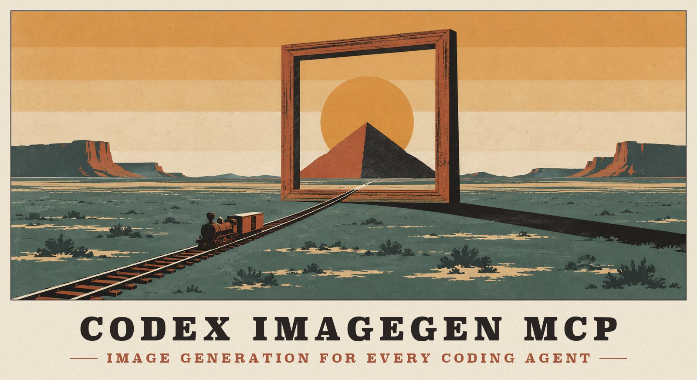
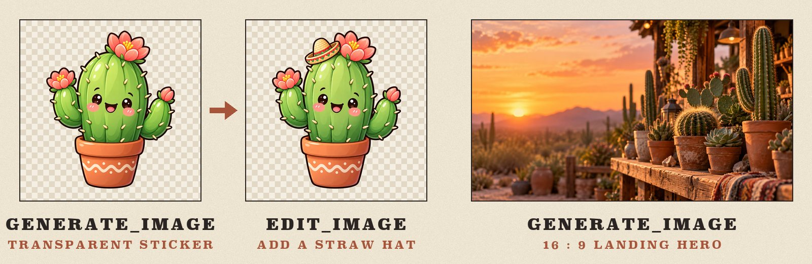
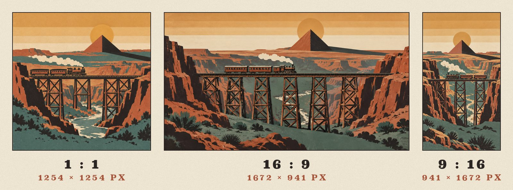
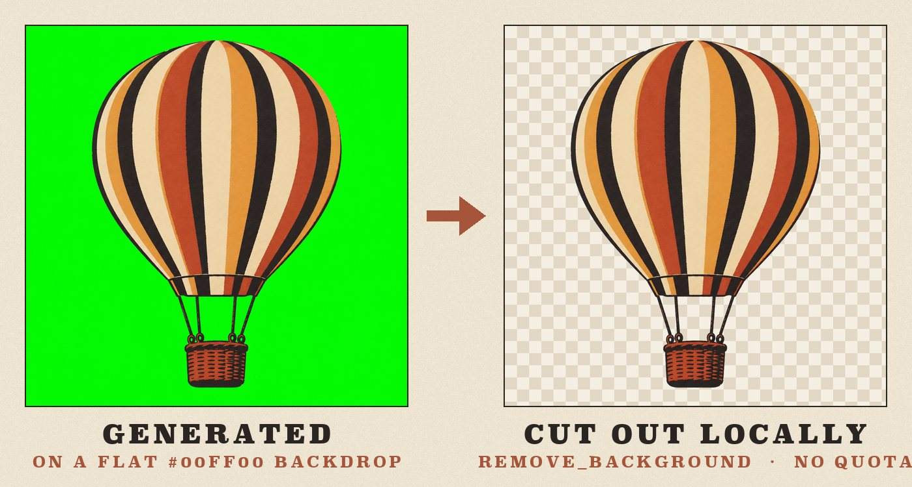
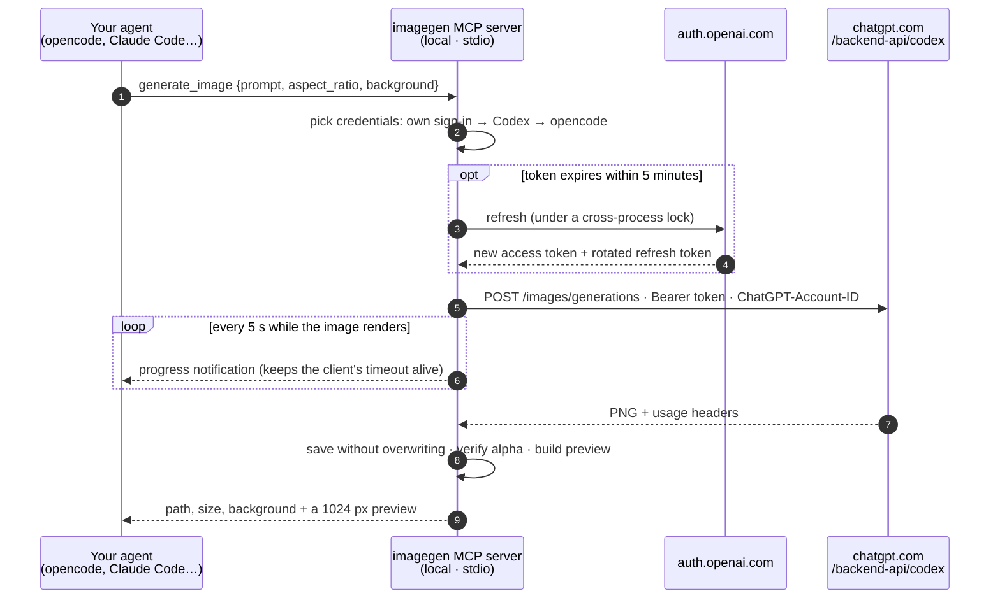
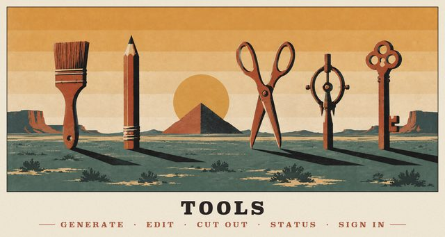
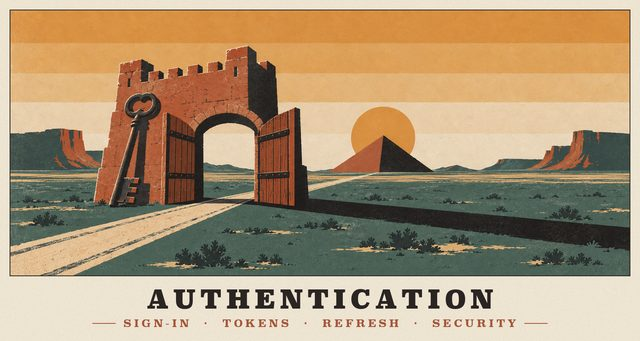
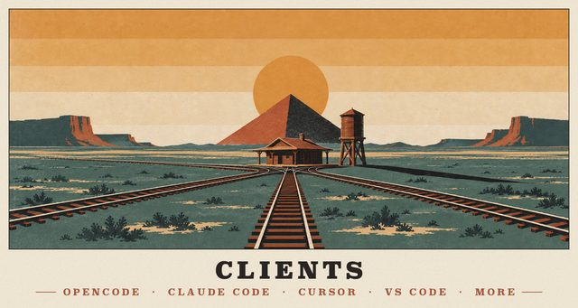
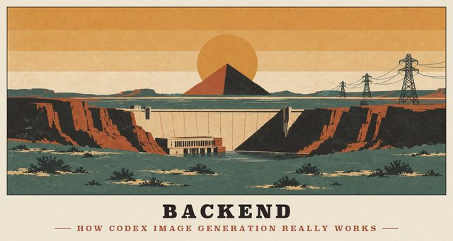
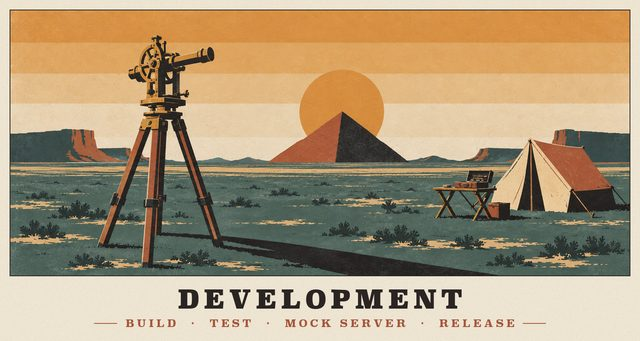

<p align="center">
  
</p>

<p align="center">
  <b>Codex's image generation, in every coding agent.</b><br>
  Generate and edit images from opencode, Claude Code, Cursor, VS Code and any other MCP client.<br>
  It runs on the ChatGPT plan you already pay for, so there's no API key and no per-image bill.
</p>

<p align="center">
  
  
  
  
</p>

<p align="center">
  <a href="#quick-start"><b>Quick start</b></a> &nbsp;·&nbsp;
  <a href="#see-it-work"><b>See it work</b></a> &nbsp;·&nbsp;
  <a href="docs/TOOLS.md"><b>Tools</b></a> &nbsp;·&nbsp;
  <a href="docs/AUTH.md"><b>Sign-in</b></a> &nbsp;·&nbsp;
  <a href="docs/CLIENTS.md"><b>Clients</b></a> &nbsp;·&nbsp;
  <a href="docs/README.md"><b>All docs</b></a>
</p>

<br>

## What it does

<table>
  <tr>
    <td width="33%" valign="top">
      <br>
      <b>Your ChatGPT plan, not an API bill</b><br>
      Sign in once with ChatGPT, or reuse the sign-in Codex or opencode already has. Every image counts against the plan you already pay for.
    </td>
    <td width="33%" valign="top">
      <br>
      <b>Works in any MCP client</b><br>
      A standard local stdio server. opencode installs in one command; Claude Code, Cursor, VS Code, Windsurf and Gemini CLI take one pasted snippet.
    </td>
    <td width="33%" valign="top">
      <br>
      <b>Real transparent PNGs</b><br>
      Ask for <code>background: "transparent"</code> and get genuine alpha, checked on every file. A local chroma-key tool handles the rest.
    </td>
  </tr>
  <tr>
    <td width="33%" valign="top">
      <br>
      <b>Any canvas shape</b><br>
      Eleven aspect ratios from 21:9 to 9:21, and up to four variants of a prompt in parallel.
    </td>
    <td width="33%" valign="top">
      <br>
      <b>Saves into your project, safely</b><br>
      Paths resolve to your workspace. An existing file is never overwritten; you get <code>hero-2.png</code> instead.
    </td>
    <td width="33%" valign="top">
      <br>
      <b>Codex's own playbook</b><br>
      Ships the <code>imagegen</code> skill from the Codex app, adapted to these tools: prompt structure, edit invariants, save rules.
    </td>
  </tr>
</table>

## See it work

Two real opencode sessions in a scratch project. The images are exactly what came back:

<p align="center">
  
</p>

> **You:** I need a sticker-style illustration of a cute cartoon cactus with a transparent background for this project. Save it as `assets/cactus-sticker.png`.
>
> **opencode** · `openai/gpt-5.5` loads the `imagegen` skill → `imagegen_generate_image` with `background: "transparent"` → *"Saved `assets/cactus-sticker.png`, 1254×1254 PNG with a transparent background."*
>
> **You:** Make a 16:9 hero banner for the Cactus Shop landing page, and a variant of the sticker where the cactus wears a tiny straw hat. Keep everything else identical.
>
> **opencode** · `github-copilot/claude-sonnet-5` → `imagegen_auth_status` → `imagegen_generate_image` (`aspect_ratio: "16:9"`) and `imagegen_edit_image` (`images: ["assets/cactus-sticker.png"]`) in parallel → both saved, the edit with *"transparent background (alpha verified)"*.

**One prompt, three canvases.** `aspect_ratio` doesn't crop. The service composes a new picture for each shape:

<p align="center">
  
</p>

**A green screen becomes alpha on your machine.** `remove_background` keys out a flat backdrop locally, with no network call and no quota:

<p align="center">
  
</p>

> [!TIP]
> Every image in this repository was made with codex-imagegen-mcp itself. That covers the posters, the badges, the logo and the examples. The prompts and the art-direction record are in [docs/assets](docs/assets/README.md).

## Quick start

> [!NOTE]
> You need **Node.js 20+** and a **ChatGPT plan that includes Codex** (Plus, Pro, Business, Enterprise, Edu…). Codex image generation isn't available on the Free plan.

**1 · Install and build**

```bash
git clone <this repo> codex-imagegen-mcp && cd codex-imagegen-mcp
npm install && npm run build
npm link                                  # puts `codex-imagegen-mcp` on your PATH
```

**2 · Add it to opencode.** This registers the MCP server and the skill, keeping your config's comments and formatting.

```bash
codex-imagegen-mcp install opencode
```

**3 · Sign in with ChatGPT.** Skip this if Codex or opencode is already signed in with ChatGPT.

```bash
codex-imagegen-mcp login                  # opens the browser; use --device on a headless machine
```

**4 · Check, then ask for pictures**

```bash
codex-imagegen-mcp doctor                 # Node, credentials, quota, opencode entry, skill
opencode mcp list                         # → ✓ imagegen connected
```

```text
you › Make a 16:9 hero image of a lighthouse at dusk and save it to assets/hero.png
```

## How it works



It sends the same request as the image tool built into the Codex app, byte for byte. As OpenAI improves Codex's image model on the server, this server gets the same upgrade. [How that was reverse-engineered →](docs/BACKEND.md)

## Signing in

| You already have… | What happens |
|---|---|
| **Codex** (CLI or desktop app) signed in with ChatGPT | Works immediately. The server borrows `~/.codex/auth.json` **read-only**. |
| **opencode** signed in with *OpenAI → ChatGPT Plus/Pro* | Works immediately. It borrows `~/.local/share/opencode/auth.json` read-only. |
| Neither, or you want an independent sign-in | Run `codex-imagegen-mcp login`, or ask your agent to call the `sign_in` tool. |

```bash
codex-imagegen-mcp login            # browser → sign in → "You're signed in to Codex ImageGen MCP"
codex-imagegen-mcp login --device   # SSH/headless: enter a code at auth.openai.com/codex/device
codex-imagegen-mcp status           # account, plan, credential source and usage windows
codex-imagegen-mcp logout           # remove and revoke this tool's own sign-in
```

> [!IMPORTANT]
> OpenAI refresh tokens are **single-use**. Borrowed sign-ins are therefore never refreshed or modified, so this server can't sign you out of Codex or opencode. Its own tokens are stored `0600` and refreshed under a lock shared by every server process. [Authentication in depth →](docs/AUTH.md)

## Tools

| Tool | What it does | Key parameters |
|---|---|---|
| `generate_image` | A new image from a prompt | `prompt` · `aspect_ratio` · `background` · `n` · `output_path` |
| `edit_image` | Edit images, or generate from 1–5 references | `images` · `prompt` · same options |
| `remove_background` | Cut a flat backdrop out locally (no quota) | `input_path` · `key_color` (auto) · `output_path` |
| `auth_status` | Sign-in, plan, credential source, usage windows | `check_usage` |
| `sign_in` | Start a ChatGPT sign-in and return a link or code for you | `method` (`browser` · `device`) |

The server also exposes the resources `imagegen://history`, `imagegen://images/{id}` and `imagegen://skill/*`, and the prompts `generate` and `edit`. In opencode the prompts appear as `/imagegen:generate` and `/imagegen:edit`. [Full reference →](docs/TOOLS.md)

## From the terminal

The CLI uses the same engine as the MCP tools:

```bash
codex-imagegen-mcp generate "a watercolor fox in a snowy forest" -a 16:9 -o art/fox.png
codex-imagegen-mcp generate "Image 1: add a tiny straw hat; keep everything else" \
  -i assets/cactus.png -b transparent -o assets/cactus-hat.png
codex-imagegen-mcp remove-bg sprite-on-green.png -o sprite.png
codex-imagegen-mcp config claude-code     # print the setup for another client
```

## Other clients

| Client | Setup |
|---|---|
| **opencode** | `codex-imagegen-mcp install opencode` (automated, reversible with `uninstall`) |
| **Claude Code** | `claude mcp add --scope user imagegen -- node /path/to/dist/src/cli.js serve` |
| **Claude Desktop · Cursor · VS Code · Windsurf · Gemini CLI · Codex** | `codex-imagegen-mcp config <client>` prints a ready-to-paste config |

Per-client guidance, including where each one loads skills from: [docs/CLIENTS.md](docs/CLIENTS.md).

## Documentation

<table>
  <tr>
    <td width="33%" valign="top">
      <a href="docs/TOOLS.md"></a><br>
      <b><a href="docs/TOOLS.md">Tools</a></b><br>
      Every tool, parameter, result field, resource and error.
    </td>
    <td width="33%" valign="top">
      <a href="docs/AUTH.md"></a><br>
      <b><a href="docs/AUTH.md">Authentication</a></b><br>
      PKCE and device-code sign-in, token rotation, borrowing, security.
    </td>
    <td width="33%" valign="top">
      <a href="docs/CLIENTS.md"></a><br>
      <b><a href="docs/CLIENTS.md">Clients</a></b><br>
      opencode, Claude Code, Cursor, VS Code, Windsurf, Gemini CLI and more.
    </td>
  </tr>
  <tr>
    <td width="33%" valign="top">
      <a href="docs/BACKEND.md"></a><br>
      <b><a href="docs/BACKEND.md">Backend</a></b><br>
      How Codex's image generation really works: extracted and measured.
    </td>
    <td width="33%" valign="top">
      <a href="docs/ARCHITECTURE.md"></a><br>
      <b><a href="docs/ARCHITECTURE.md">Architecture</a></b><br>
      Modules, the request flow and the design decisions behind them.
    </td>
    <td width="33%" valign="top">
      <a href="docs/DEVELOPMENT.md"></a><br>
      <b><a href="docs/DEVELOPMENT.md">Development</a></b><br>
      Build, the mock-backed test suite, live testing, releases.
    </td>
  </tr>
</table>

## FAQ

<details>
<summary><b>Does it cost anything?</b></summary>
<br>

No extra money. Images come out of your ChatGPT plan's Codex usage limits, the same as images you make in the Codex app. `codex-imagegen-mcp status` (or the `auth_status` tool) shows the 5-hour and weekly windows, and checking them uses no quota.

</details>

<details>
<summary><b>Is the output the same as Codex's built-in image tool?</b></summary>
<br>

Yes. The endpoint, request body and auth headers are identical to the ones the Codex desktop app sends. The service picks the model, resolution and quality itself, for Codex and for this server alike.

</details>

<details>
<summary><b>Can I choose <code>gpt-image-2.5</code>, an exact size or a quality level?</b></summary>
<br>

Not with a ChatGPT sign-in. The service ignores `model`, `size`, `quality` and `n`. That was measured, including requests for the newer `gpt-image-2.5-sunburst` and `-flare` models, and the tools deliberately don't pretend otherwise. Choose the shape with `aspect_ratio`; for exact pixels, resize or crop afterwards. Selecting a model explicitly requires the billed OpenAI Platform API, which is out of scope by design. [The measurements →](docs/BACKEND.md#newer-image-models)

</details>

<details>
<summary><b>Where do images go?</b></summary>
<br>

They go to `output_path`, relative to your workspace, when you give one. Otherwise they land in the image library at `~/.local/share/codex-imagegen-mcp/images/<date>/`. Every file is also recorded in `imagegen://history`. Existing files are never replaced unless you pass `overwrite: true`.

</details>

<details>
<summary><b>Will it sign me out of Codex or opencode?</b></summary>
<br>

No. Borrowed sign-ins are read-only: they're used while their access token is valid and are never refreshed or written. Its own sign-in (`login`) is independent. [Why that matters →](docs/AUTH.md#why-borrowed-sign-ins-are-read-only)

</details>

<details>
<summary><b>Is this official?</b></summary>
<br>

No. It's an unofficial integration that uses the same public OAuth client and internal ChatGPT endpoints as the Codex CLI, as opencode's ChatGPT sign-in also does. Those interfaces are undocumented and may change. Use it within OpenAI's Terms of Use.

</details>

## Configuration

<details>
<summary>Environment variables</summary>
<br>

| Variable | Default | Purpose |
|---|---|---|
| `CODEX_IMAGEGEN_HOME` | `~/.local/share/codex-imagegen-mcp` | Credentials, history, logs and the default image library |
| `CODEX_IMAGEGEN_OUTPUT_DIR` | `$CODEX_IMAGEGEN_HOME/images` | Where images go when no `output_path` is given |
| `CODEX_IMAGEGEN_CREDENTIALS` | `auto` | `auto` (own → Codex → opencode), or pin `own`, `codex` or `opencode` |
| `CODEX_IMAGEGEN_TIMEOUT_MS` | `300000` | Per-request timeout for the image service |
| `CODEX_IMAGEGEN_LOG_LEVEL` | `info` | `debug`, `info`, `warn`, `error` or `silent`; the log is `$CODEX_IMAGEGEN_HOME/server.log` |
| `CODEX_IMAGEGEN_NO_BROWSER` | unset | Never open a browser automatically |
| `CODEX_HOME` | `~/.codex` | Where to look for a Codex sign-in |
| `CODEX_IMAGEGEN_ORIGINATOR` | `codex-imagegen-mcp` | The `originator` identifying this client to OpenAI |

Test-only overrides: `CODEX_IMAGEGEN_BASE_URL`, `CODEX_IMAGEGEN_USAGE_URL`, `CODEX_IMAGEGEN_AUTH_ISSUER`, `CODEX_IMAGEGEN_CLIENT_ID`, `CODEX_IMAGEGEN_OPENCODE_AUTH_FILE`.

</details>

## Troubleshooting

Start with `codex-imagegen-mcp doctor`. It checks Node, the data directory, credentials, backend reachability and quota, the sign-in ports, the opencode entry and duplicate skills.

<details>
<summary>Common problems</summary>
<br>

| Symptom | Fix |
|---|---|
| `Not signed in` | `codex-imagegen-mcp login` (or `--device`), or open Codex/opencode once so their sign-in refreshes |
| `usage limit … resets in …` | Wait for the reset; `status` shows the windows |
| `ports 1455 and 1457 are busy` | Another Codex or opencode login is waiting. Finish it, or use `login --device` |
| `Device-code sign-in is not enabled` | ChatGPT → Settings → Security → allow device code authorization for Codex |
| Tools missing in opencode | Check `opencode mcp list`, re-run `install opencode`, then restart opencode |
| An opaque result despite `transparent` | Retry, or generate on a flat `#00FF00` backdrop and run `remove_background` |

</details>

---

<p align="center">
  <br>
  <sub>
    Unofficial; not affiliated with or endorsed by OpenAI. Usage counts against your ChatGPT plan and is subject to OpenAI's Terms of Use.<br>
    Generated images carry OpenAI's C2PA provenance metadata. Apache-2.0; the bundled skill is adapted from OpenAI Codex (Apache-2.0), see <a href="NOTICE">NOTICE</a>.
  </sub>
</p>
