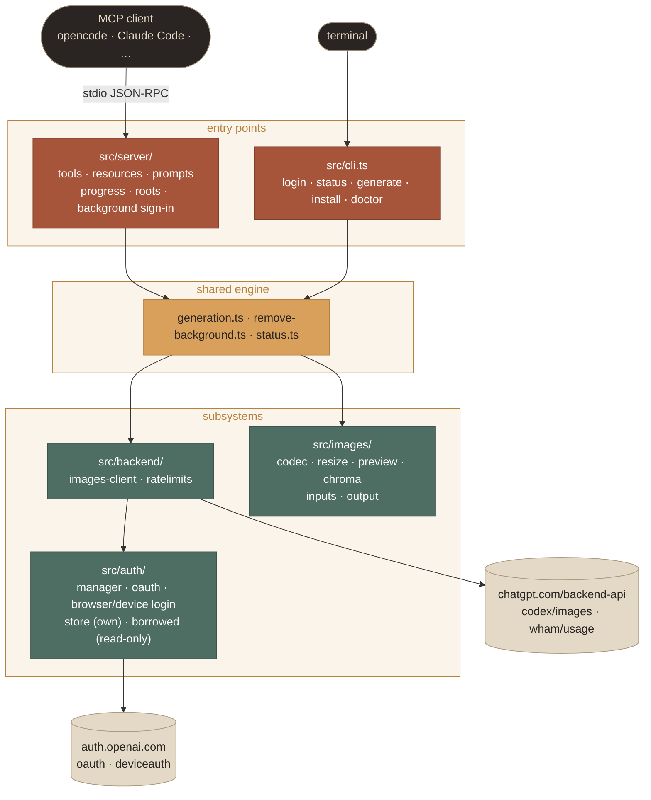
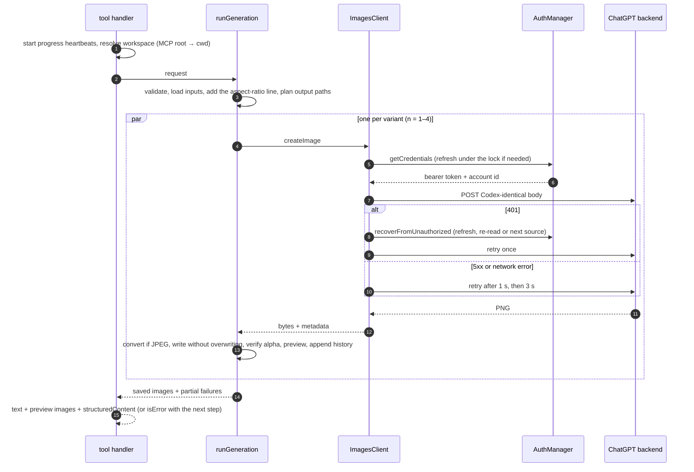

  

# Architecture

A small, layered codebase: two entry points, a shared engine, and three focused subsystems for auth, the backend and images. This page maps the modules, traces one request end to end, and explains the decisions behind the design.

**On this page:** [Module map](#module-map) · [Modules](#modules) · [Request flow](#request-flow-generate_image) · [Design decisions](#design-decisions)

## Module map

## Modules

| Path | Responsibility |
|---|---|
| `src/constants.ts` | Protocol constants (issuer, client id, ports, endpoints, limits), each with the reason it has that value |
| `src/config.ts` | Resolves the environment into a `RuntimeConfig`: paths, URLs, mode, timeouts |
| `src/auth/` | Sign-in flows, the token store, refresh, and credential source resolution |
| `src/backend/` | The ChatGPT image and usage HTTP client, error mapping, rate-limit parsing |
| `src/images/` | Pure-JS image handling: sniffing, codec, resampling, previews, chroma key, I/O |
| `src/generation.ts` | One generate/edit operation: load inputs → *n* concurrent requests → save → history → previews |
| `src/remove-background.ts` | One chroma-key operation |
| `src/status.ts` | Collects and formats sign-in, source and usage status |
| `src/history.ts` | The append-only `history.jsonl` |
| `src/server/` | MCP wiring: tools, resources, prompts, instructions, progress, roots, background sign-in |
| `src/install/` | The multi-client installer: `clients.ts` (the registry of 26 tools), `formats.ts` (JSONC/TOML/YAML edits), `launch.ts`, `detect.ts`, `skills.ts`, `plan.ts` (plan, apply, uninstall), `wizard.ts` (the clack UI) and `commands.ts`. Design notes: [INSTALLER.md](INSTALLER.md) |
| `src/login.ts` | The terminal ChatGPT sign-in, shared by `login` and the installer |
| `src/doctor.ts` | Environment diagnostics |
| `src/cli.ts` | The command-line entry point; `serve` is the MCP entry |
| `skill/imagegen-mcp/` | The Agent Skill shipped with the server |
| `upstream/` | Byte-exact copy of Codex's original skill, for provenance and diffing |
| `scripts/compose-doc-art.py` | Builds the documentation artwork from raw generations |
| `scripts/render-installer-screens.py` | Renders the installer screenshots from a real terminal session |

## Request flow: `generate_image`

Each variant is saved **as soon as it arrives**, so partial success is kept even if another variant fails.

## Design decisions

- **ChatGPT sign-in only, no API key.** The goal is to use the subscription people already pay for, exactly like Codex. The Platform API needs separate billing and is deliberately out of scope.
- **The same request as Codex.** Endpoints, body and auth match `codex-rs` byte for byte, so the server behaves like Codex and inherits OpenAI's server-side model upgrades.
- **Borrowing is read-only.** Refresh tokens are single-use, so a second refresher would sign the owning app out. Borrowed tokens are used until they expire, and are never refreshed or written.
- **Refresh is lock-serialized.** Clients spawn several server processes (opencode runs one per project). A lock file plus a re-read under the lock means exactly one refresh per rotation.
- **Honest parameters.** The service ignores model, size, quality, count and format, so the tools don't pretend otherwise. `aspect_ratio` is a prompt line, which the service measurably honors; `n` is fan-out; JPEG is a local conversion.
- **Previews, not full images, in tool results.** A 1024 px JPEG goes to the model and the full-resolution file goes to disk. That keeps results far below the MCP SDK's 10 MB stdio limit and clients' attachment limits (opencode: 5 MiB, 2000 px), while still letting the model check its work.
- **No `resource_link` content.** Older clients reject unknown content types, and opencode drops them. Paths go in text and `structuredContent` instead.
- **Constraints repeated in descriptions.** opencode strips `min`, `max` and `default` from JSON Schemas for OpenAI models, so every limit is also written in the parameter description.
- **Progress heartbeats.** opencode resets its per-request timeout on progress, so long generations survive its 60 s default without special configuration.
- **Background sign-in inside the server.** `sign_in` can hand the user a link at once. MCP elicitation isn't widely supported (opencode lacks it), so returning the link as text is the portable choice.
- **Pure-JS image handling.** `pngjs` and `jpeg-js` mean no native dependencies, so it installs everywhere, which matters because MCP servers are launched from many environments.
- **Never overwrite.** This mirrors the Codex skill's save policy, and it's enforced in code (`wx` exclusive create with versioned siblings) rather than merely requested of the model.
- **The installer plans, then applies.** Planning is read-only and produces the review the user sees; applying re-reads each file before writing. Clients are declarative records, so adding one is data plus a test, and every client gets the same backups, conflict protection and uninstall rules.
- **Edit, don't rewrite.** Configs belong to other tools and often to their users' dotfiles. JSONC, TOML and YAML are edited only at our key, and each edit is re-parsed and compared before anything is written.
- **stdout hygiene.** In `serve`, `console.log`, `console.info` and `console.debug` are redirected to stderr, and logs go to stderr plus `server.log`. The server exits when stdin closes, which is how clients stop stdio servers.

---

<a href="BACKEND.md">← Backend</a> &nbsp;·&nbsp; <a href="README.md">Docs home</a> &nbsp;·&nbsp; <a href="DEVELOPMENT.md">Development →</a>

