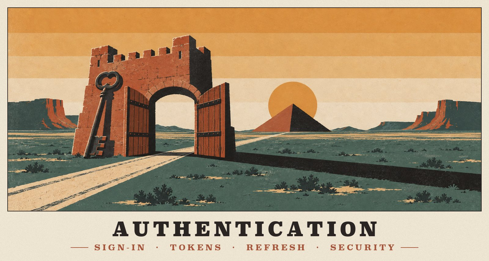
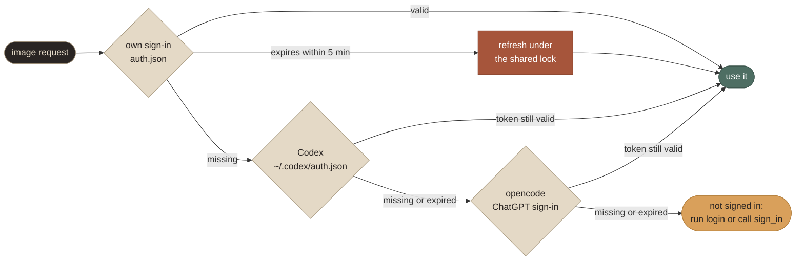
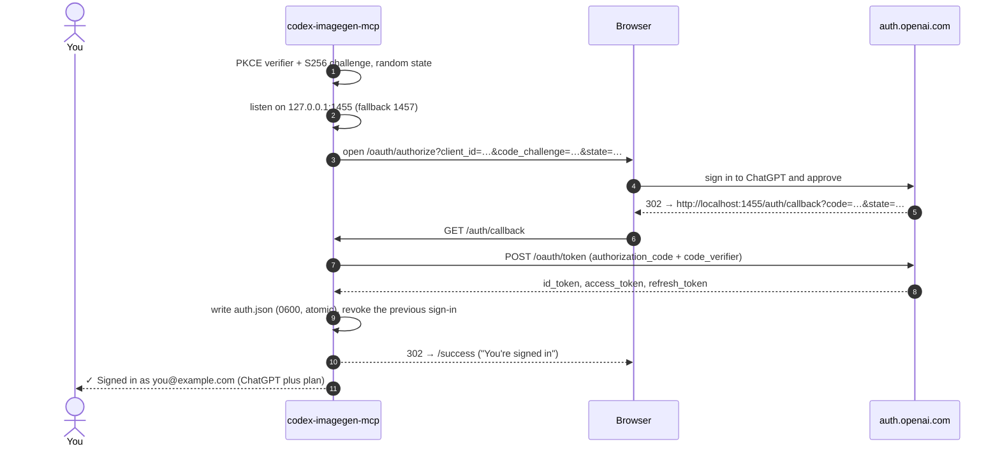
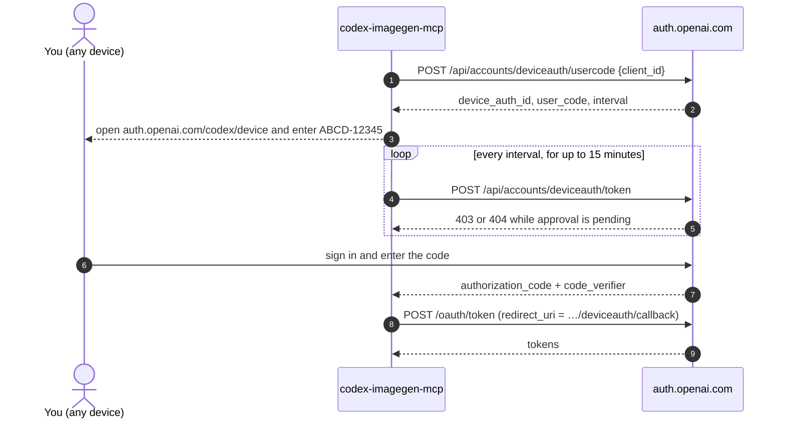
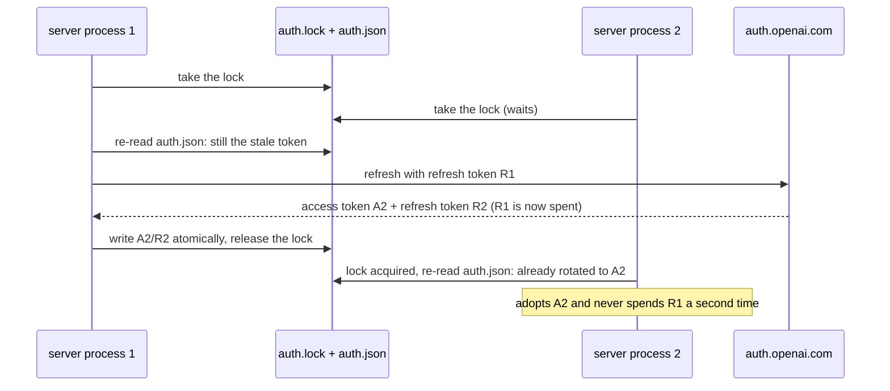

<p align="center">
  
</p>

# Authentication

How the Codex image tool authenticates, how this server reproduces it, and how you sign in before using it. Every protocol detail was checked against the Codex source at tag `rust-v0.155.0-alpha.16` (the build inside Codex desktop 26.917.51856) and against the live service.

**On this page:** [TL;DR](#tldr) · [Credential sources](#credential-sources) · [Browser sign-in](#browser-sign-in) · [Device-code sign-in](#device-code-sign-in) · [Token storage](#token-storage) · [Refresh](#refresh) · [Request headers](#request-headers) · [Plans and workspaces](#plans-and-workspaces) · [Signing out](#signing-out) · [Troubleshooting](#troubleshooting) · [Security notes](#security-notes)

## TL;DR

> [!TIP]
> - Image requests go to `https://chatgpt.com/backend-api/codex/images/{generations,edits}` with `Authorization: Bearer <ChatGPT access token>` and `ChatGPT-Account-ID: <workspace id>`.
> - The token comes from **OpenAI's OAuth server** (`auth.openai.com`) through the **Codex CLI's public client**. Browser sign-in uses authorization code with PKCE; headless machines use OpenAI's device-code variant.
> - Access tokens live about **10 days** and are renewed with **single-use, rotating** refresh tokens.
> - The server uses its **own** sign-in, or **borrows** an existing Codex or opencode ChatGPT sign-in **read-only**.

## Credential sources

At every request, the server takes the first source that yields a valid token:



| # | Source | File | Refreshed by this server? |
|---|---|---|---|
| 1 | **Own sign-in** (`codex-imagegen-mcp login` or the `sign_in` tool) | `$CODEX_IMAGEGEN_HOME/auth.json`, by default `~/.local/share/codex-imagegen-mcp/auth.json` | **Yes**, automatically, under a cross-process lock |
| 2 | **Codex** CLI or desktop app | `$CODEX_HOME/auth.json`, by default `~/.codex/auth.json` | **No**, read-only |
| 3 | **opencode** "ChatGPT Plus/Pro" provider | the `openai` entry in `~/.local/share/opencode/auth.json` | **No**, read-only |

To pin a single source, set `CODEX_IMAGEGEN_CREDENTIALS=own|codex|opencode` (the default is `auto`). `codex-imagegen-mcp status` and the `auth_status` tool show every source and which one is active.

### Why borrowed sign-ins are read-only

> [!IMPORTANT]
> OpenAI refresh tokens are **single-use**. Every refresh returns a new refresh token and invalidates the old one; reuse fails with `refresh_token_reused`, which Codex handles in `codex-rs/login/src/auth/manager.rs`. If this server refreshed Codex's or opencode's token, that app would later present an already-spent refresh token and be signed out.

So borrowed tokens are used only while their access token is valid, judged by the JWT `exp` claim with a 60-second margin. After that the server moves on to the next source. The owning app renews its own token the next time it runs; Codex, for example, refreshes when fewer than 5 minutes remain. Borrowed files are never written.

Codex users on the `keyring` credential store have no `auth.json`, so for them this source reports "not signed in". Use `login` instead.

## Browser sign-in

```bash
codex-imagegen-mcp login
```



1. **PKCE and state.** The CLI generates a PKCE pair (64 random bytes as a base64url verifier, plus its S256 challenge) and a random `state`.
2. **Loopback server.** It starts a server on `127.0.0.1:1455`, falling back to `1457`. These exact ports are required: OpenAI allow-lists only `http://localhost:1455/auth/callback` and `…:1457/…` for this client. If a stale Codex or codex-imagegen login server holds the port, it is asked to `GET /cancel`, as Codex does.
3. **Authorize URL.** It opens this URL in your browser:

   ```text
   https://auth.openai.com/oauth/authorize?response_type=code&client_id=app_EMoamEEZ73f0CkXaXp7hrann
     &redirect_uri=http://localhost:1455/auth/callback&scope=openid%20profile%20email%20offline_access
     &code_challenge=…&code_challenge_method=S256&id_token_add_organizations=true
     &codex_cli_simplified_flow=true&state=…&originator=codex-imagegen-mcp
   ```

4. **Callback.** You sign in and approve, and the browser returns to `/auth/callback?code=…&state=…`.
   - A mismatched `state` is answered with HTTP 400, and the login keeps waiting.
   - An `error` parameter ends the login with a readable message. `missing_codex_entitlement` means Codex isn't enabled for the workspace.
5. **Token exchange.** The code is exchanged for tokens at `POST https://auth.openai.com/oauth/token`, form-encoded with `grant_type=authorization_code`, `code`, `redirect_uri`, `client_id` and `code_verifier`.
6. **Save.** The tokens are saved and the browser shows *You're signed in*. If this tool already had a sign-in, its refresh token is revoked.

The flow times out after 10 minutes, and Ctrl+C cancels it. The `sign_in` MCP tool runs the same flow inside the server: it returns the link to the agent immediately, tries to open it, and finishes in the background.

> [!NOTE]
> **Scopes:** `openid profile email offline_access`. Codex also asks for `api.connectors.read api.connectors.invoke`, but the image endpoints don't need them, so this server asks for less.
>
> **Remote machines:** the redirect goes to `localhost`, so the browser must run on the same machine as the server. Over SSH, use the device code, or forward the port with `ssh -L 1455:localhost:1455 host` and open the printed URL locally.

## Device-code sign-in

```bash
codex-imagegen-mcp login --device
```



1. **Request a code.** `POST https://auth.openai.com/api/accounts/deviceauth/usercode` with `{client_id}` returns `{device_auth_id, user_code, interval}`.
2. **Enter it.** You open **https://auth.openai.com/codex/device** on any device and enter the code, which is valid for 15 minutes.
3. **Poll.** The CLI polls `POST …/api/accounts/deviceauth/token` with `{device_auth_id, user_code}`. HTTP 403 or 404 means approval is still pending.
4. **Exchange.** Once you approve, the response carries `{authorization_code, code_verifier}`; the server supplies the PKCE pair. The code is exchanged at `/oauth/token` with `redirect_uri=https://auth.openai.com/deviceauth/callback`.

> [!WARNING]
> A 404 on step 1 means device codes are disabled for your account. Enable "device code authorization for Codex" in **ChatGPT → Settings → Security**. On a workspace, an admin may need to allow it.

## Token storage

The server's own `auth.json` is written atomically (temp file, then rename) with mode `0600`, in a `0700` directory:

```json
{
  "version": 1,
  "auth_mode": "chatgpt",
  "tokens": {
    "id_token": "<JWT>",
    "access_token": "<JWT, ~10 day lifetime>",
    "refresh_token": "<opaque, single-use>",
    "account_id": "<chatgpt_account_id from the id_token>"
  },
  "last_refresh": "2026-09-23T01:02:03.000Z",
  "login_method": "browser",
  "created_at": "2026-09-23T01:02:03.000Z"
}
```

The field names inside `tokens` match Codex's `auth.json`. Tokens are never logged; the log file records events only.

## Refresh

**When it happens:**
- when the access token's `exp` is within **5 minutes**, as in Codex;
- once `last_refresh` is 8 days old, if the token has no `exp`;
- once after any **401** from the backend.

**The request:** `POST https://auth.openai.com/oauth/token` with the JSON body `{"client_id": "…", "grant_type": "refresh_token", "refresh_token": "…"}`. There is no `scope`, exactly like Codex.

**Concurrency.** MCP clients may run several server processes at once; opencode, for example, runs one per open project. Refreshes are therefore serialized:



Tests verify that three concurrent processes produce exactly one refresh call.

**When a refresh fails:**
- **Permanent:** `refresh_token_expired`, `refresh_token_reused`, `refresh_token_invalidated`, any 401, and 400 `invalid_grant`. You're asked to sign in again.
- **Transient:** anything else. The current token is kept while it's still valid, and the refresh is retried on the next use.

## Request headers

| Header | Value |
|---|---|
| `Authorization` | `Bearer <access_token>` |
| `ChatGPT-Account-ID` | `tokens.account_id`, the workspace to bill |
| `originator` | `codex-imagegen-mcp` (override with `CODEX_IMAGEGEN_ORIGINATOR`) |
| `User-Agent` | `codex-imagegen-mcp/<version> (<os> <release>; <arch>) node/<version>` |
| `X-OpenAI-Fedramp` | `true`, only when the token's `chatgpt_account_is_fedramp` claim is true |

## Plans and workspaces

- **Plan:** read from the JWT claim `chatgpt_plan_type`. The Codex client hides image generation on **Free**. This server still sends the request and reports the backend's answer clearly.
- **Workspace:** the sign-in's `chatgpt_account_id` claim. To use another workspace, sign in again and choose it on the consent screen; `sign_in` with `force: true` does this from the agent.
- **Quota:** usage counts against your plan's Codex limits. `status` and `auth_status` read `GET https://chatgpt.com/backend-api/wham/usage`, which costs nothing, to show the 5-hour and weekly windows.

## Signing out

```bash
codex-imagegen-mcp logout              # revoke the refresh token at /oauth/revoke, then delete auth.json
codex-imagegen-mcp logout --no-revoke
```

Borrowed Codex and opencode sign-ins are never touched; sign out of those apps separately.

## Troubleshooting

| Message | Cause | Fix |
|---|---|---|
| `Not signed in to ChatGPT … (Checked — …)` | No source has a valid token | `login`, or open Codex/opencode once so their sign-in refreshes |
| `…refresh token was already used` | Another machine or process spent the same refresh token (e.g. a copied `auth.json`) | `login` again, and don't share `auth.json` between machines |
| `ports 1455 and 1457 are busy` | Another Codex or opencode login is waiting | Finish or close it, or use `--device` |
| `Device-code sign-in is not enabled for this account` | Device codes are disabled | Enable them in ChatGPT → Settings → Security, or use the browser flow |
| `Codex is not enabled for your ChatGPT workspace` | Workspace policy (`missing_codex_entitlement`) | Ask the workspace admin |
| `ChatGPT rejected the … (HTTP 401)` | The token was revoked or expired on the server | `login` again |
| `Access denied (HTTP 403)` | The plan or workspace lacks Codex image generation (e.g. Free) | Upgrade, or switch workspace |
| `blocked by Cloudflare` | Your network was flagged | Retry later or from another network |

## Security notes

- **The OAuth client:** `app_EMoamEEZ73f0CkXaXp7hrann` is OpenAI's public native client for the Codex CLI. It has no client secret, and PKCE protects the flow. opencode's ChatGPT sign-in uses the same client. This project identifies itself honestly through `originator` and `User-Agent`.
- **Your tokens:** they grant access to your ChatGPT account's Codex features. Treat `auth.json` like a password; that's why it's `0600`.
- **What leaves your machine:** only requests to `auth.openai.com` and `chatgpt.com`, plus downloads of any `http(s)` input image URLs you pass. There is no telemetry.
- **Terms of use:** this is an unofficial integration of an internal API. Use it within OpenAI's Terms of Use.

---

<p align="center"><a href="TOOLS.md">← Tools</a> &nbsp;·&nbsp; <a href="README.md">Docs home</a> &nbsp;·&nbsp; <a href="CLIENTS.md">Clients →</a></p>
