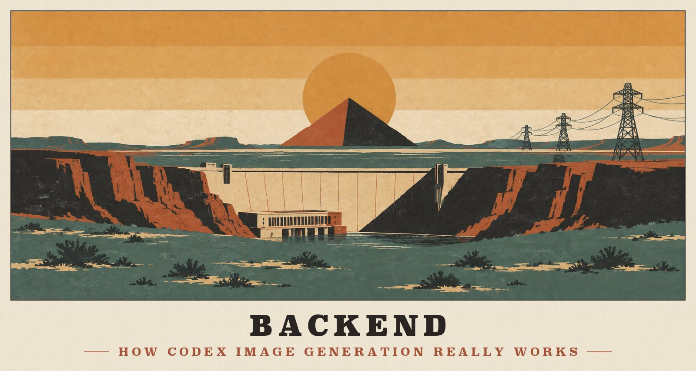
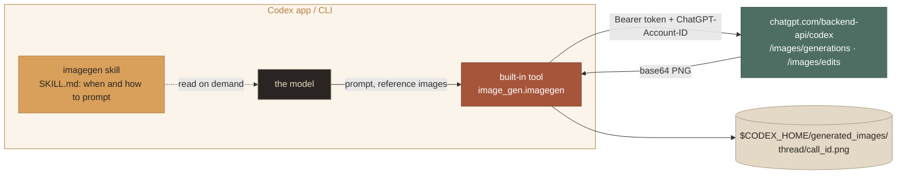

<p align="center">
  
</p>

# Backend

How the image generation in OpenAI Codex really works. These findings come from taking apart the Codex desktop app and its bundled CLI, reading the matching open-source code, and measuring the live service. Nothing here is guessed; unmeasured points are marked as such.

> [!NOTE]
> **Measured on** 2026-09-22 and 2026-09-23 with a ChatGPT **Plus** account.
> - **App:** Codex desktop `/Applications/ChatGPT.app`, bundle `com.openai.codex`, version 26.917.51856.
> - **CLI:** its bundled `Contents/Resources/codex`, version 0.155.0-alpha.16.
> - **Source:** `openai/codex@rust-v0.155.0-alpha.16`.

**On this page:** [Two layers](#two-layers-a-skill-and-a-built-in-tool) · [The HTTP API](#the-http-api) · [What the service honors](#what-the-service-honors) · [Newer image models](#newer-image-models) · [Quota and rate limits](#quota-and-rate-limits) · [Output files](#output-files) · [Compared with Codex](#compared-with-codexs-built-in-tool)

## Two layers: a skill and a built-in tool



1. **The `imagegen` skill** is instructions only.
   - It's embedded in the `codex` binary and written to `$CODEX_HOME/skills/.system/imagegen/` on startup, fingerprinted in `.codex-system-skills.marker`.
   - The model sees only its name, description and path, and reads `SKILL.md` on demand.
   - It covers when to generate, how to structure prompts, and where to save.
   - It also offers an API-key CLI fallback (`scripts/image_gen.py`) and a chroma-key helper (`scripts/remove_chroma_key.py`).
   - A byte-exact copy is in [`upstream/codex-imagegen-skill/`](../upstream/codex-imagegen-skill/).
2. **The built-in tool `image_gen.imagegen`** does the work.
   - It's registered by the `codex-rs/ext/image-generation` crate as a namespaced function tool with three inputs: `prompt`, `referenced_image_paths` (up to 5 absolute paths) and `num_last_images_to_include` (1–5 recent images). The last two are mutually exclusive.
   - It's offered only when **all** of these hold (`core/src/tools/spec_plan.rs`):
     - the `image_generation` feature is on, which it is by default;
     - the account is **not on Free**;
     - the model accepts image input;
     - the provider uses ChatGPT auth. API-key auth gets no tool.

## The HTTP API

```http
POST https://chatgpt.com/backend-api/codex/images/generations    # no input images
POST https://chatgpt.com/backend-api/codex/images/edits          # with input images
Authorization: Bearer <ChatGPT OAuth access token>
ChatGPT-Account-ID: <chatgpt_account_id>
originator: <client id, e.g. codex_cli_rs>
User-Agent: <originator>/<version> (<os>; <arch>) <terminal>
Content-Type: application/json

{"prompt":"…","background":"auto","model":"gpt-image-2","quality":"auto","size":"auto"}
# edits add: "images":[{"image_url":"data:image/png;base64,…"}]  (max 5)
```

- **Constants:** Codex hard-codes `model: "gpt-image-2"`, `quality: "auto"`, `size: "auto"` and `background: "auto"` (`ext/image-generation/src/tool.rs`). Upstream `main` was unchanged as of 2026-09-22.
- **Response:**
  - Body: `{created, background, data:[{b64_json, generation_id}], output_format, quality, size, usage}`.
  - Headers: `x-codex-imagegen-request-id`, `x-oai-request-id`, and the rate-limit headers below.
- **What Codex does with it:** it decodes the first image to `$CODEX_HOME/generated_images/<thread>/<call_id>.png` and returns it to the model with a note that the user can already see it. The desktop app renders it inline, with Edit/Canvas actions.

## What the service honors

| Request | Result |
|---|---|
| `size: "17x17"` | 1536×1024; an invalid size is silently ignored |
| `size: "1024x1024"`, `quality: "medium"`, `output_format: "jpeg"`, `n: 2` | **1370×1148, quality `low`, PNG, one image**: all four ignored |
| `model: "gpt-image-bogus-does-not-exist"` | 200 OK and a normal image: the model is ignored |
| `background: "transparent"` (generation) | **An RGBA PNG** with real alpha (opaque areas carry alpha 251–254) |
| `background: "transparent"` (edit: "remove the table and backdrop") | **An RGBA PNG**, 55% fully transparent |
| `background: "opaque"` plus a prompt about keying out a green backdrop | **A transparent PNG anyway**; rewording the green as printed paper returned an opaque image |
| A prompt starting "Tall vertical 9:16 portrait phone wallpaper: …" | **941×1672**, exactly 9:16 |
| A prompt ending "Aspect ratio: 16:9, wide landscape (horizontal) canvas." | **1672×941**, exactly 16:9 |
| The same line with `21:9` / `1:1` | **1916×821** / **1254×1254** |
| An edit with a 21:9 reference image and a `21:9` line | **1916×821**; style carried over, the new composition followed the prompt |
| 4 requests in parallel on one account | All returned 200, in 17–25 s each |

> [!IMPORTANT]
> **Only `prompt`, `background` and `images` influence the result**, and even `background` is a strong hint rather than a switch. Model, quality, pixel size, count and format are chosen by the service. The canvas shape follows the **prompt text**.

That's why this server:
- exposes `aspect_ratio` as a prompt line;
- implements `n` as parallel requests;
- converts JPEG output locally;
- verifies the alpha channel on every transparent request;
- offers no `model`, `size` or `quality` parameter that would be silently ignored.

## Newer image models

OpenAI released `gpt-image-2.5-sunburst` and `gpt-image-2.5-flare` on 2026-09-08. On the public Images API they add `xhigh`/`max` quality and native transparency. Through a **ChatGPT sign-in**:

- **The images endpoint** (`/backend-api/codex/images/*`) ignores the model name. Requests for a 2.5 model, `xhigh`/`max` quality or a 2K size came back at the service's default size, with `medium` or `low` quality.
- **The Responses endpoint** (`POST /backend-api/codex/responses` with the hosted `image_generation` tool) **rewrites the tool config** to `{"model":"gpt-image-2-codex","quality":"auto","size":"auto",…}`, as its `response.created` echo shows. Options the rewritten model doesn't support are rejected up front:

  | Option | Error |
  |---|---|
  | `background: "transparent"` | `400 image_generation_user_error: "Transparent background is not supported for this model."` |
  | `input_fidelity` | `400 invalid_input_fidelity_model: "The model 'gpt-image-2-codex' does not support the 'input_fidelity' parameter."` |
  | An unknown model name | fails with `server_is_overloaded` |

  This path also returns a `revised_prompt`, but it adds a chat-model turn, so it's slower and costlier.
- **The Codex app's "ImageGen 2.5" announcement** ("Image creation got a major upgrade") is gated by a Statsig flag. The client still sends `gpt-image-2`, so the upgrade happens on the server: whatever model backs `gpt-image-2` for Codex (reported as `gpt-image-2-codex`) is what every ChatGPT-signed-in client gets.

> [!TIP]
> A ChatGPT sign-in can't select a model. This server, like Codex, automatically gets OpenAI's server-side upgrades to the Codex image model. Picking `gpt-image-2.5-*` explicitly, with exact sizes or `xhigh`/`max` quality, requires the billed OpenAI Platform API, which is out of scope by design.

## Quota and rate limits

**`GET https://chatgpt.com/backend-api/wham/usage`** takes the same auth headers and costs **no quota**. It returns:
- `plan_type`;
- `rate_limit.{allowed, limit_reached, primary_window, secondary_window}`, where the primary window is 5 hours (`limit_window_seconds: 18000`) and the secondary is weekly (`604800`), each with `used_percent`, `reset_at` and `reset_after_seconds`;
- `additional_rate_limits` and `credits`.

The Codex apps use it for their usage display, and this server uses it for `auth_status`, `status` and `doctor`.

Every image response also carries headers:

| Header | Meaning |
|---|---|
| `x-codex-plan-type` | The plan, e.g. `plus` |
| `x-codex-active-limit` | The limit being counted (observed: `premium`) |
| `x-codex-{primary,secondary}-{used-percent,window-minutes,reset-at,reset-after-seconds}` | Window state |
| `x-codex-credits-*` | Credits balance and flags |
| `x-image-gen-*` | A separate image limit (limit id `image_gen`), when one applies |

- **Exhausted limits:** a `429` returns `{"error":{"type":"usage_limit_reached","resets_at":…,"plan_type":…}}`, and `usage_not_included` means the plan lacks the feature.
- **Retries:** Codex retries 5xx and transport errors, never 429. So does this server.
- **Cost of a session:** generating the 15 images for these docs used about 5% of a Plus plan's 5-hour window and 1% of the weekly one.

## Output files

- **Format and size:** PNG at about 1.5 MP, shaped by the prompt: 1536×1024, 1024×1536, 1672×941, 941×1672, 1916×821, 1254×1254 or 1370×1148.
- **Latency:** 12–48 s per request.
- **Provenance:** every file carries a **C2PA** manifest in a `caBX` chunk. It's signed by "OpenAI Media Service", with claim generator `ChatGPT`/`gpt-image` and `digitalSourceType` `trainedAlgorithmicMedia`. This server writes the service's PNG bytes unchanged, so the manifest survives; converting to JPEG drops it.

## Compared with Codex's built-in tool

| | Codex built-in `image_gen` | codex-imagegen-mcp |
|---|---|---|
| **Clients** | Codex CLI, IDE and app only | Any MCP client |
| **Auth** | Codex's ChatGPT sign-in | Its own sign-in (browser or device), or Codex/opencode borrowed read-only |
| **Endpoint and body** | `/images/{generations,edits}`, as above | Identical |
| **Save location** | `$CODEX_HOME/generated_images/…`; the model copies files into the project | Directly to `output_path` in the workspace, never overwriting, or the library |
| **Inputs** | Absolute paths or recent images | Paths (workspace-relative works), URLs, data URLs |
| **Aspect ratio** | Via the prompt | The `aspect_ratio` parameter, written as a prompt line |
| **Variants** | One call per variant | `n` from 1 to 4, in parallel |
| **Transparency** | `background` not exposed ("ask for transparency") | `background: "transparent"` passed through, and the alpha verified |
| **Chroma key** | A Python script | The built-in `remove_background` tool, same algorithm |
| **Result for the model** | The full image | A 1024 px JPEG preview, with the full file on disk |

Authentication is covered in [Authentication](AUTH.md): OAuth (PKCE or device code) with the Codex public client, roughly 10-day access tokens and rotating single-use refresh tokens. The minimal scopes (`openid profile email offline_access`) are enough for the image endpoints.

---

<p align="center"><a href="CLIENTS.md">← Clients</a> &nbsp;·&nbsp; <a href="README.md">Docs home</a> &nbsp;·&nbsp; <a href="ARCHITECTURE.md">Architecture →</a></p>
