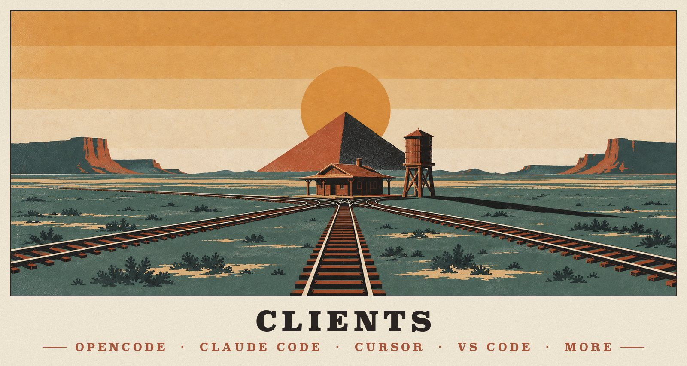
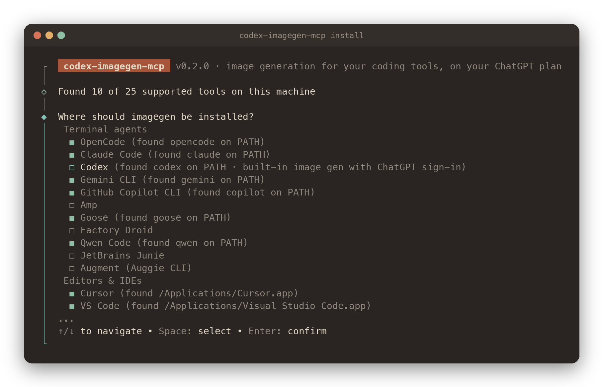
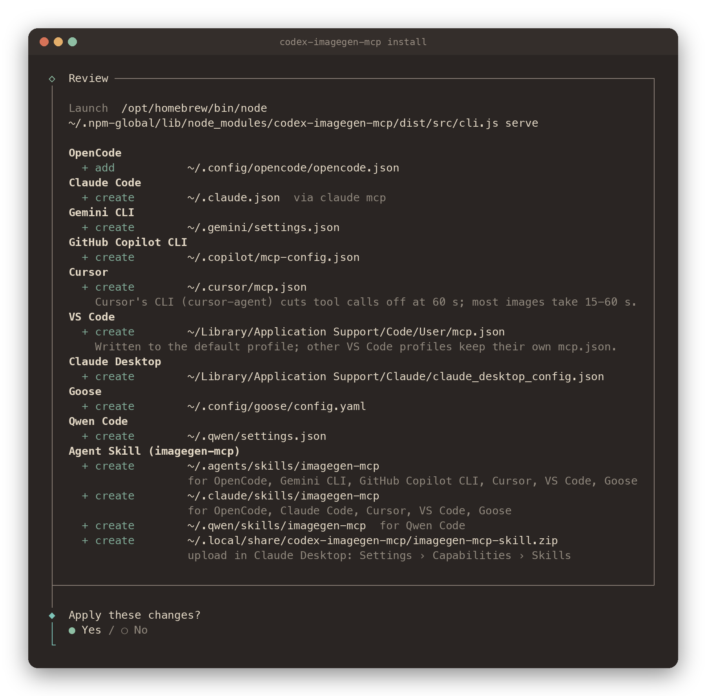

<p align="center">
  
</p>

# Clients

The server is a local **stdio** MCP server, so any MCP client can run it: many tracks, one station. One command sets it up in 25+ coding tools. It finds the tools on your machine, shows every file it will touch, and edits only its own entry, keeping your comments and formatting.

**On this page:** [The installer](#the-installer) · [What it will and won't do](#what-it-will-and-wont-do) · [Launch command](#how-the-launch-command-is-chosen) · [The skill](#where-the-skill-goes) · [Supported tools](#supported-tools) · [Per-tool notes](#per-tool-notes) · [Anything else](#any-other-client)

## The installer

```bash
codex-imagegen-mcp install                        # interactive: pick tools, review, apply, sign in
```

<p align="center">
  
</p>

The wizard pre-selects the tools it detects (Codex excepted; see [its notes](#codex-cli-ide-extension-desktop-app)). Then it asks four quick questions:

1. **Tools.** Detection is advisory, so you can pick a tool that isn't installed yet.
2. **Scope.** *All projects* writes each tool's user config. *This project only* writes project files like `.cursor/mcp.json` that you can commit.
3. **Skill.** Whether to install the [Agent Skill](#where-the-skill-goes).
4. **Launch.** How tools start the server; the recommended choice is explained [below](#how-the-launch-command-is-chosen).

It then shows the plan, applies it once you confirm, offers a ChatGPT sign-in, and prints what to do in each tool:

<p align="center">
  
</p>

Everything the wizard does is scriptable:

```bash
codex-imagegen-mcp install --list                 # every supported tool: detected? installed?
codex-imagegen-mcp install opencode cursor        # named tools, no questions asked
codex-imagegen-mcp install --all                  # every detected tool (Codex only when named)
codex-imagegen-mcp install claude-code --project  # this project's .mcp.json and .claude/skills
codex-imagegen-mcp install zed --dry-run          # show the plan, write nothing
codex-imagegen-mcp uninstall cursor               # remove it again (no names: choose interactively)
codex-imagegen-mcp config goose                   # print the snippet to add by hand instead
```

| Option | Meaning |
|---|---|
| `--all` · `-y` | Every detected tool (with `-y` and no names, the same as `--all`) |
| `--project` · `--scope global\|project` | Project files in the current directory instead of your user config |
| `--launch auto\|node\|npx\|global` | How tools start the server ([details](#how-the-launch-command-is-chosen)); `--command "<cmd …>"` sets an exact command |
| `--no-skill` · `--skill-only` | Leave out the Agent Skill, or install only the skill |
| `--name <server>` | Server key in each config (default `imagegen`); letters, digits, `-` and `_` |
| `--timeout <ms>` | Tool-call timeout written where the tool has one (default 300000, converted to each tool's unit) |
| `--env KEY=VALUE` | Extra environment for the server, e.g. `--env CODEX_IMAGEGEN_OUTPUT_DIR=~/Pictures/ai` |
| `--dry-run` · `--json` | Show the plan without writing; machine-readable plan and results |
| `--force` | Replace an entry or skill folder that belongs to something else |
| `uninstall --keep-skill` | Remove the MCP entries but keep the skill copies |

Without tool names and outside a terminal, `install` exits with a hint instead of waiting on a prompt, so scripts fail fast. Then run `codex-imagegen-mcp doctor`: it checks every tool that has imagegen configured, verifying that the launch command and script exist and that the entry is enabled.

## What it will and won't do

- **Shows before it writes.** The plan lists every file and folder with *create*, *add*, *update*, *up to date*, *conflict* or *error*. `--dry-run` stops there.
- **Edits only its own key.** JSON and JSONC files are edited in place with `jsonc-parser`, so comments, key order and indentation survive. For Codex's TOML, only the `[mcp_servers.imagegen]` table and its subtables are replaced; everything else stays byte for byte. Goose's YAML goes through the `yaml` document API, which keeps comments. Every edit is re-parsed, and nothing is written unless only our key changed.
- **Won't clobber a stranger.** An existing `imagegen` entry is updated only if it launches this package. Anything else is a conflict: pass `--name` to use another name, or `--force` to replace it (the wizard asks).
- **Skips broken files.** A config that doesn't parse is reported and left alone; the other tools are still installed.
- **Writes carefully.** Each file is re-read just before writing (it may have changed since the preview), backed up to `<file>.codex-imagegen-mcp.bak`, and replaced atomically with its permissions kept. A symlinked config (dotfile managers) is written through the link.
- **Uses the tool's own CLI where that's safer.** Claude Code rewrites `~/.claude.json` constantly, so the user-scope entry goes through `claude mcp add-json` when the `claude` command can be run, with a direct edit as the fallback.
- **Removes only what it installed.** `uninstall` removes entries that launch this package. It removes skill copies only if they carry its marker file and no tool that stays installed reads them. Your ChatGPT sign-in is kept; `logout` removes it.

## How the launch command is chosen

| `--launch` | Command written | Default for |
|---|---|---|
| `node` | Absolute Node + this package's `cli.js`, e.g. `/opt/homebrew/bin/node …/codex-imagegen-mcp/dist/src/cli.js serve` | Global installs from an installed package. No PATH, shim or network needed at start-up, and it works in GUI apps that don't inherit your shell `PATH`. |
| `npx` | `npx -y codex-imagegen-mcp@0.2 serve` (pinned to the current release line) | Project files meant to be committed, and runs of `npx codex-imagegen-mcp install` |
| `global` | `codex-imagegen-mcp serve` | Only on request; needs `npm install --global` and `node` on the tool's PATH |

Adjustments per tool:

- **Windows.** `npx` and npm's command shims are `.cmd` files that not every tool can start, so they are wrapped as `cmd /c …`.
- **GUI apps on macOS and Linux** (Claude Desktop, editors) get absolute paths and a `PATH` that contains Node.
- **Node itself** is written as a stable symlink such as `/opt/homebrew/bin/node` rather than a versioned path that breaks on upgrade. Per-shell fnm paths are never written, and nvm paths come with a warning.
- **Global installs pin environment variables.** Several tools pass servers only a few environment variables; Copilot CLI passes just `PATH`. So when `CODEX_HOME`, `XDG_DATA_HOME`, `CODEX_IMAGEGEN_HOME`, `CODEX_IMAGEGEN_OUTPUT_DIR` or `CODEX_IMAGEGEN_CREDENTIALS` are set in your shell, the global entries carry them. Every tool then finds the same sign-in. Project files never carry machine-specific values.

## Where the skill goes

The skill is called **`imagegen-mcp`**. Codex ships a system skill named `imagegen`, and tools that read Codex's folders would otherwise list two. The installer copies it into the fewest folders that cover every tool you picked:

1. Copies it installed earlier are kept and refreshed.
2. Then folders are added by how many of the remaining tools read them, preferring the shared **`~/.agents/skills`**. Codex, Gemini CLI, Copilot CLI, OpenCode, Cursor, VS Code, Zed, Goose, Amp, Droid, Devin, Cline and others read it.
3. Tools with a folder of their own get a copy there: Claude Code `~/.claude/skills`, Qwen Code `~/.qwen/skills`, Kiro `~/.kiro/skills`, Antigravity `~/.gemini/config/skills`.
4. **Claude Desktop** has no local skill folder. The installer writes `imagegen-mcp-skill.zip` to the data directory; upload it in *Settings › Capabilities › Skills*.

Each copy carries a `.codex-imagegen-mcp.json` marker. The installer never writes into a folder that holds someone else's skill of the same name unless you pass `--force`. Copies named `imagegen` from earlier releases are removed once the new copy is in place, and only if they carry the marker. Tools that read two of the chosen folders see identical copies. That's harmless, though OpenCode may pick either one.

## Supported tools

| Tool | `id` | User config it edits | Project file | Timeout written | Reads the skill from |
|---|---|---|---|---|---|
| **OpenCode** | `opencode` | `~/.config/opencode/opencode.json[c]` → `mcp` | `opencode.json[c]` | `timeout: 300000` ms | `~/.agents/skills` (also `~/.claude/skills`, `~/.config/opencode/skills`) |
| **Claude Code** | `claude-code` | `~/.claude.json` → `mcpServers`, via `claude mcp add-json` | `.mcp.json` | — (default ≈ 28 h) | `~/.claude/skills` |
| **Codex** (CLI, IDE, app) | `codex` | `~/.codex/config.toml` → `[mcp_servers.imagegen]` | `.codex/config.toml` | `startup_timeout_sec = 60`, `tool_timeout_sec = 300` | `~/.agents/skills` |
| **Gemini CLI** | `gemini` | `~/.gemini/settings.json` → `mcpServers` | `.gemini/settings.json` | — (default 10 min) | `~/.agents/skills` |
| **GitHub Copilot CLI** | `copilot` | `~/.copilot/mcp-config.json` → `mcpServers` | `.github/mcp.json` | `timeout: 300000` ms (default 30 s) | `~/.agents/skills` |
| **Cursor** | `cursor` | `~/.cursor/mcp.json` → `mcpServers` | `.cursor/mcp.json` | not configurable | `~/.agents/skills` |
| **VS Code** · Insiders · VSCodium | `vscode` · `vscode-insiders` · `vscodium` | `<user data>/User/mcp.json` → `servers` | `.vscode/mcp.json` | — (none) | `~/.agents/skills` |
| **Claude Desktop** | `claude-desktop` | `claude_desktop_config.json` → `mcpServers` | — | — | zip upload |
| **Devin Desktop** (formerly Windsurf) | `devin` | `~/.config/devin/mcp_config.json` → `mcpServers` | `.devin/mcp_config.json` | — | `~/.agents/skills` |
| **Windsurf** (legacy builds) | `windsurf` | `~/.codeium/windsurf/mcp_config.json` | — | — | `~/.codeium/windsurf/skills` |
| **Zed** | `zed` | `~/.config/zed/settings.json` → `context_servers` | `.zed/settings.json` | `timeout: 300` s (default 60) | `~/.agents/skills` |
| **Cline** | `cline` | `~/.cline/data/settings/cline_mcp_settings.json`, plus each editor's copy | — | `timeout: 300` s (default 60) | `~/.agents/skills` |
| **Zoo Code** / Roo Code | `zoo` | the extension's `mcp_settings.json` in each editor | `.roo/mcp.json` | `timeout: 300` s (default 60) | `~/.agents/skills` |
| **Kilo Code** | `kilo` | `~/.config/kilo/kilo.json[c]` → `mcp` | `kilo.json[c]` | `timeout: 300000` ms | `~/.agents/skills` |
| **Amp** | `amp` | `~/.config/amp/settings.json[c]` → `amp.mcpServers` | `.amp/settings.json` | — | `~/.agents/skills` |
| **Goose** | `goose` | `~/.config/goose/config.yaml` → `extensions` | — | `timeout: 300` s | `~/.agents/skills` |
| **Factory Droid** | `droid` | `~/.factory/mcp.json` → `mcpServers` | `.factory/mcp.json` | `timeout: 300000`, `connectTimeout: 60000` ms | `~/.agents/skills` |
| **Qwen Code** | `qwen` | `~/.qwen/settings.json` → `mcpServers` | `.qwen/settings.json` | — (default 10 min) | `~/.qwen/skills` |
| **Kiro** | `kiro` | `~/.kiro/settings/mcp.json` → `mcpServers` | `.kiro/settings/mcp.json` | — | `~/.kiro/skills` |
| **JetBrains Junie** | `junie` | `~/.junie/mcp/mcp.json` → `mcpServers` | `.junie/mcp/mcp.json` | — | `~/.agents/skills` |
| **Augment** (Auggie CLI) | `auggie` | `~/.augment/settings.json` → `mcpServers` | `.augment/settings.json` | — | `~/.agents/skills` |
| **Google Antigravity** | `antigravity` | `~/.gemini/config/mcp_config.json` → `mcpServers` | `.agents/mcp_config.json` | — | `~/.gemini/config/skills` |
| **Visual Studio** (Windows) | `visual-studio` | `%USERPROFILE%\.mcp.json` → `servers` | — | — | — |
| **JetBrains AI Assistant** | `jetbrains-ai` | UI only: the installer prints the JSON to paste | — | — | — |

Paths are the macOS/Linux ones; the installer knows the Windows equivalents, for example `%APPDATA%\Claude`, `%APPDATA%\Zed`, `%APPDATA%\devin` and `%APPDATA%\Block\goose\config`. It also honours `XDG_CONFIG_HOME`, `CLAUDE_CONFIG_DIR`, `CODEX_HOME`, `COPILOT_HOME`, `GEMINI_CLI_HOME`, `JUNIE_HOME`, `VSCODE_APPDATA` and Cline's `CLINE_*` variables. The skill column shows where the installer puts the skill for that tool; several tools read other folders too.

How the tools name our tools:

| Tool | `generate_image` appears as |
|---|---|
| OpenCode, Kilo Code | `imagegen_generate_image` |
| Claude Code, Codex | `mcp__imagegen__generate_image` |
| Gemini CLI | `mcp_imagegen_generate_image` |
| Copilot CLI | `imagegen-generate_image` |
| Others | listed under the `imagegen` server |

## Per-tool notes

### OpenCode

- **Timeout.** OpenCode applies the entry's `timeout` to every MCP request, tool calls included, and resets it on each progress notification. 300 s is a safe ceiling.
- **Where files land.** OpenCode starts the server in the project directory and reports it as an MCP root, so relative `output_path`s land in the project.
- **Previews.** They reach vision models on every provider: inside the tool result with OpenAI models over ChatGPT, as a follow-up attachment with GitHub Copilot and others. Verified with `openai/gpt-5.5` and `github-copilot/claude-sonnet-5`.
- **Check.** `opencode mcp list` should show `✓ imagegen connected`.

### Claude Code

- **Restart.** Start a new session after installing; `claude mcp list` should show imagegen.
- **Project installs.** Claude Code asks you to approve servers from `.mcp.json` the first time.
- **Timeout.** Its default tool timeout is about 28 hours, so the entry sets none.

### Codex (CLI, IDE extension, desktop app)

- **You may not need this.** Signed in with ChatGPT, Codex already has built-in image generation. This entry mainly helps API-key setups, and the wizard doesn't pre-select Codex.
- **Timeouts.** Codex stops tool calls after 60 s and server start-up after 10 s by default, so the entry raises both.
- **Environment.** Codex passes servers only an allow-listed environment, which is why global entries pin `CODEX_HOME` and friends.
- **Project files.** `.codex/config.toml` is read only in trusted projects.

### Cursor

- **Enable it.** Restart Cursor and make sure imagegen is enabled under *Settings › MCP*.
- **CLI limit.** Cursor's terminal agent (`cursor-agent`) stops tool calls after 60 s, which is not configurable; most images take 15–60 s.

### VS Code, Insiders and VSCodium

- **Start it.** Run *MCP: List Servers*, start imagegen and trust it when asked.
- **Profiles.** The installer writes the default profile's `mcp.json`, like `code --add-mcp` does; other profiles have their own file.
- **Project files.** `.vscode/mcp.json` is shared, so selecting several variants writes it once.

### Claude Desktop

- **Restart.** Quit it completely and reopen it.
- **Output paths.** It starts servers with `/` as the working directory, so pass absolute `output_path`s; otherwise images go to the image library.
- **Skill.** Upload `imagegen-mcp-skill.zip` in *Settings › Capabilities › Skills*.
- **Linux.** There's no official build; the installer uses the path community builds read.

### Devin Desktop and legacy Windsurf

- **Rename.** Windsurf became Devin Desktop in June 2026; current builds read `~/.config/devin/mcp_config.json`.
- **Duplicates.** Devin also imports MCP servers from other tools' configs, so imagegen can appear twice. Turn one off.

### Zed

- **Live reload.** Settings apply immediately.
- **Timeout.** The per-server `timeout` is in seconds and overrides Zed's 60 s default.

### Cline

- **Two files.** Cline ships two extension bundles that read different settings files. The installer writes the shared `~/.cline/data/settings/cline_mcp_settings.json` and, for every editor where the extension is installed, that editor's globalStorage copy.
- **Timeout.** Seconds, default 60; without it the newer bundle allows only 3 s to connect.

### Zoo Code and Roo Code

- **Roo shut down.** Roo Code shut down in May 2026; Zoo Code continues it with the same settings. The installer writes the global settings of whichever of the two is installed, per editor, or `.roo/mcp.json` in a project.

### Goose

- **No project file.** Goose only has a global config.
- **Restart.** Start a new session, or restart Goose Desktop.

### GitHub Copilot CLI

- **Environment.** Copilot passes servers only `PATH`, so global entries pin the variables listed [above](#how-the-launch-command-is-chosen).
- **Project files.** `.github/mcp.json` is read in trusted folders. A `.mcp.json` in the same folder wins, including one written for Claude Code.

## Any other client

Any MCP client that can launch a stdio server works: point it at `codex-imagegen-mcp serve`, or print a snippet with `codex-imagegen-mcp config <id>` and adapt it. For the best experience the client should:

- allow tool calls of at least about 90 s, or reset its timeout on progress notifications;
- support image content in tool results, so the model sees the preview. Without it, the model still gets the saved paths and metadata.

Not automated, and why:

- **Continue** is frozen and drops image results.
- **Crush**'s new `crushrc` syntax is unverified.
- **Kimi CLI** has conflicting docs.
- **Trae**'s global config path is undocumented.
- **Warp**'s file schema is undocumented.

Clients without skill support can read the skill from the server as `imagegen://skill/SKILL.md`; the essentials are also in the server's MCP instructions.

---

<p align="center"><a href="AUTH.md">← Authentication</a> &nbsp;·&nbsp; <a href="README.md">Docs home</a> &nbsp;·&nbsp; <a href="BACKEND.md">Backend →</a></p>
