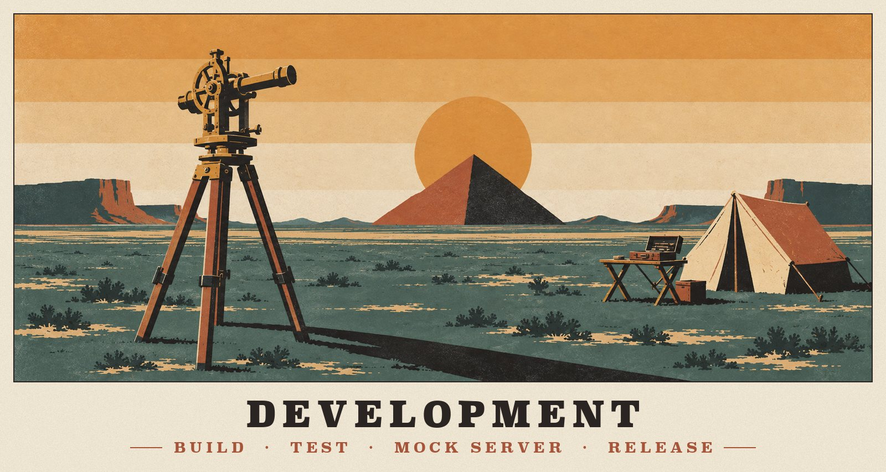
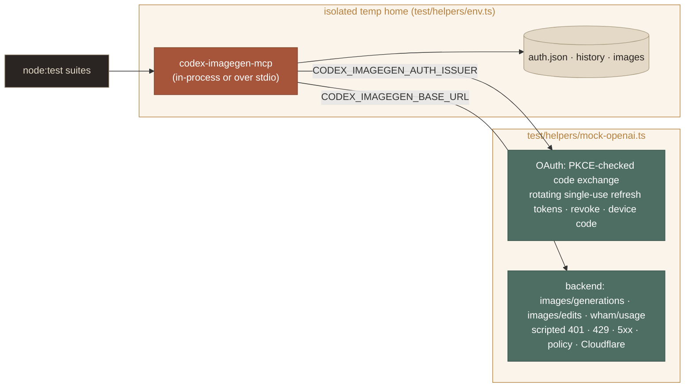
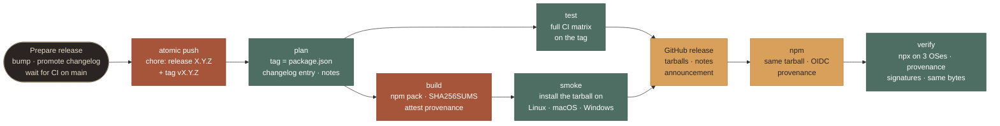

<p align="center">
  
</p>

# Development

Build it, test it without touching OpenAI, test it live, and ship it.

**On this page:** [Setup](#setup) · [Layout](#layout) · [Tests](#tests) · [Continuous integration](#continuous-integration) · [Live testing](#live-testing) · [Conventions](#conventions) · [Adding a client](#adding-a-client) · [Artwork](#artwork) · [Updating from upstream Codex](#updating-from-upstream-codex) · [Releasing](#releasing)

## Setup

You need Node.js 22 or newer.

```bash
git clone https://github.com/ShalomObongo/codex-imagegen-mcp.git && cd codex-imagegen-mcp
npm ci
npm run build        # tsc → dist/, marks dist/src/cli.js executable (works on Windows too)
npm test             # build + the node:test suite
npm run typecheck
npm link             # optional: expose `codex-imagegen-mcp` globally for manual testing
```

Contribution guidelines, commit style and the pull-request checklist are in [CONTRIBUTING.md](../.github/CONTRIBUTING.md).

## Layout

```text
src/             TypeScript sources (see ARCHITECTURE.md)
test/            node:test suites; test/helpers/mock-openai.ts mocks auth.openai.com + the ChatGPT backend
skill/imagegen-mcp/  the Agent Skill shipped with the server
upstream/        byte-exact copy of the Codex skill it was adapted from
scripts/         release.ts (versions, changelog, release notes), smoke.ts and
                 verify-published.ts (release checks); compose-doc-art.py and
                 render-installer-screens.py build docs/assets
docs/            this documentation; docs/assets holds the artwork
```

## Tests

The suite never talks to OpenAI. Every test runs against a scriptable mock and an isolated temp home:



- **The mock behaves like the real service where it matters.** It checks the PKCE `code_verifier` against the challenge and the `redirect_uri`, and its refresh tokens are **single-use**: a second use returns `refresh_token_reused`, just as OpenAI does.
- **Scripting failures:** queue responses in `state.imageQueue` to simulate 401, 429, 5xx, policy and Cloudflare errors, and set delays to exercise timeouts and locking.
- **Nothing real is touched.** `test/helpers/env.ts` builds an isolated `CODEX_IMAGEGEN_*` environment in a temp directory, so tests never read or write your credentials. The installer tests pass an `InstallContext` (platform, home, cwd, env) pointing at a temp home. Path logic never reads process globals, so the same tests also model macOS, Linux and Windows machines, and CLI tests run with a `PATH` that contains only Node, so no real coding tool is ever launched.

| Suite | Covers |
|---|---|
| `auth-primitives` | JWT claims, PKCE, authorize URL, the 0600 store, the cross-process lock, stale locks |
| `auth-manager` | Refresh (three concurrent processes → one refresh), permanent vs transient failures, borrowed sources, 401 recovery, revoke |
| `login-flows` | Browser round trip, state mismatch, authorize errors, failed exchange, cancel, timeout, device code |
| `images-client` | Exact request body and headers, edits, retries, usage limits, policy/invalid/Cloudflare mapping, the usage API |
| `image-processing` | Codec, previews, chroma key, output planning, no-overwrite writes, input validation |
| `install-formats` | JSONC, Codex TOML and Goose YAML edits: comments, key order, CRLF, BOM, multi-line strings, refused inline tables, edit verification |
| `install-registry` | Config paths per OS and env override, entry schemas and timeout units, skill folders, launch resolution, detection |
| `install-plan` | Multi-client installs and re-runs, conflicts and `--force`, broken files, old-skill migration, uninstall that keeps shared skills, symlinks and file modes, the `claude mcp` path, project scope, the Claude Desktop zip |
| `install-wizard` | The interactive flow with scripted answers: pre-selection, cancel, replacing a conflict, sign-in, uninstall |
| `release-script` | Version bumps (npm's rules), SemVer precedence, promoting `[Unreleased]`, compare links, the changelog lint, release notes, `prepare` and `plan` end to end |
| `server` | Full MCP over stdio: tools, resources, prompts, progress, errors, sign-in via the tool and then generation |
| `cli` | Every command end to end against the mock |

## Continuous integration

Every push to `main` and every pull request runs [CI](../.github/workflows/ci.yml):

| Job | What it checks |
|---|---|
| **Node 22 · 24 · 26** on Linux | `npm ci`, `npm run typecheck`, `npm test`, a CLI smoke test |
| **Node 24** on macOS and Windows | The same, on the other two platforms |
| **Package** on Linux, macOS and Windows | `npm pack`, then [`scripts/smoke.ts`](../scripts/smoke.ts) on the tarball: a global install; installs into 18 tools (19 on Windows) in a throwaway home; reads every written config back; starts the server through each config and speaks MCP to it, with only a GUI app's `PATH` for GUI apps; runs `doctor` and `uninstall --all`. Twice: with the absolute-Node launch and with the global command, which covers the `cmd /c` wrapping on Windows. On Linux it also runs `release.js check`, so a malformed changelog fails the push rather than a release. |

The release pipeline reuses the same workflow (`workflow_call`) on the release tag. Actions are pinned to commit SHAs, and [Dependabot](../.github/dependabot.yml) keeps them and the npm dependencies current. CodeQL code scanning runs on GitHub's default setup.

To run the smoke test locally (it never touches your real home directory or tools):

```bash
npm pack && node dist/scripts/smoke.js --tarball codex-imagegen-mcp-X.Y.Z.tgz
node dist/scripts/smoke.js --registry X.Y.Z        # the published version, through npx
```

## Live testing

> [!CAUTION]
> These commands use your real ChatGPT quota. `status`, `doctor` and `auth_status` are free; every generated image counts.

```bash
node dist/src/cli.js status                        # auth + usage, no quota
node dist/src/cli.js generate "a red apple" -o tmp/live/apple.png
HOME=$(mktemp -d) node dist/src/cli.js install     # try the installer against a throwaway home
node dist/src/cli.js install opencode && opencode mcp list
opencode run -m openai/gpt-5.5 "make a transparent sticker of a cactus, save to assets/cactus.png"
opencode run -m github-copilot/claude-sonnet-5 "…"  # Copilot providers take a different media path in opencode
```

`tmp/` is git-ignored. To see what the server did inside a client, set `CODEX_IMAGEGEN_LOG_LEVEL=debug` and read `~/.local/share/codex-imagegen-mcp/server.log`.

> [!WARNING]
> Don't run `npx -y codex-imagegen-mcp …` from inside this checkout. npx resolves the package name to the checkout itself and fails with `codex-imagegen-mcp: command not found`. The same goes for a client whose config launches the server through npx, when you open a session in this folder. Use `node dist/src/cli.js` here. On your own machine, `npm install --global codex-imagegen-mcp` gives your tools an absolute launch path that works from any folder.

## Conventions

- **stdout is the protocol.** Never write to it from server code paths.
- **Errors carry the next step.** Raise `ImagegenError(kind, message)`; each kind maps to that step in `describeError`.
- **Limits live in descriptions too.** Some clients strip schema constraints before the model sees them.
- **Claims about the backend must be measured.** Record them in [Backend](BACKEND.md) with the date.
- **The skill tracks upstream.** Diff changes against `upstream/codex-imagegen-skill/` and keep the prompting guidance aligned.

## Adding a client

Clients are data. To support a new tool:

1. **Research it first.** Find its MCP config file per OS and scope, the root key and entry schema, the timeout field and its unit, the skill folders it reads, and how it's detected. Prefer the tool's source and official docs over third-party installers; several of those write outdated paths. Leave out anything you can't verify.
2. **Add a record to `CLIENT_REGISTRY` in `src/install/clients.ts`.** Declare its `configs` per scope (JSON, TOML or YAML, with candidate files and the root key path), its `entry` (reuse `stdio()` and add its timeout in its own unit), the `skills` folders in preference order, `detect` hints, `restart`, and any `notes`. Set `gui: true` for apps that may start without the shell `PATH`.
3. **Test it** in `test/install-registry.test.ts`: its paths on each OS and the exact entry. The engine tests already cover the edit, backup and uninstall behaviour.
4. **Document it** in the support matrix in [Clients](CLIENTS.md) and the client list of the bug-report form.

## Artwork

Every image in the docs was generated with this server, following the art-direction record in [docs/assets](assets/README.md). The raw generations stay out of git (about 2 MB each). `scripts/compose-doc-art.py` turns them into the committed assets:

```bash
# 1. regenerate any source with the prompts in docs/assets/README.md, saving into tmp/art/
# 2. rebuild every committed asset (Pillow + numpy; Superclarendon ships with macOS)
python3 scripts/compose-doc-art.py --art tmp/art --out docs/assets
```

The script does five things:
- **Snaps alpha.** The service returns 251–254 inside opaque areas; this rounds it to 255.
- **Typesets wording locally.** Poster titles are set in Superclarendon, so no text is ever generated.
- **Slices the badge grid** into six PNGs.
- **Builds the showcase sheets.**
- **Writes the social preview.**

Paper grain is seeded, so reruns are byte-stable.

The installer screenshots in `docs/assets/screens/` come from a real session instead. The script installs the packed tarball into a throwaway home, drives `codex-imagegen-mcp install` in a pseudo-terminal, replays it through the pyte terminal emulator and draws it in the docs palette. It needs macOS fonts and `pip install pyte fonttools pillow`, and shows whichever tools are installed on the machine:

```bash
npm pack && python3 scripts/render-installer-screens.py codex-imagegen-mcp-X.Y.Z.tgz
```

## Updating from upstream Codex

1. **Extract the current skill:** `CODEX_HOME=$(mktemp -d) /Applications/ChatGPT.app/Contents/Resources/codex debug prompt-input hi >/dev/null`. This installs the embedded system skills into `$CODEX_HOME/skills/.system/`.
2. **Diff and port.** Compare that `imagegen/` with `upstream/codex-imagegen-skill/`, update the copy, and port the relevant guidance into `skill/imagegen-mcp/`.
3. **Check the tool.** Look at `codex-rs/ext/image-generation/src/tool.rs` upstream for changes to the request body, model id or limits.

## Releasing

Releases are continuous delivery: `main` is always releasable, and cutting a release is one click. Nothing is published until the release commit has passed the full test matrix and its tarball has been installed and started on Linux, macOS and Windows. After publishing, the pipeline installs the release from npm the way users do and checks its provenance.

### Cutting a release

1. **Describe changes as they land**, under `## [Unreleased]` in [CHANGELOG.md](../CHANGELOG.md). Those notes become the release notes, and CI's changelog check keeps the file in a shape the tooling can promote.
2. **Run Prepare release.** Use *Actions › Prepare release › Run workflow* and pick the bump, or run it from a terminal:

   ```bash
   gh workflow run prepare-release.yml -f bump=patch       # or minor, major; -f version=1.0.0 for an exact one
   gh workflow run prepare-release.yml -f dry-run=true     # show the release commit and notes, push nothing
   ```

3. **Watch the Release run it starts** (`gh run watch`). Its summary links the GitHub release and the npm page, with the verification results.

> [!NOTE]
> CI never talks to ChatGPT. When a release changes sign-in or the image client, run the [live checks](#live-testing) first; they use your quota.

### The pipeline



| Stage | Workflow · job | What it guarantees |
|---|---|---|
| **Prepare** | [`prepare-release.yml`](../.github/workflows/prepare-release.yml) | Computes the version with npm's bump rules. Moves the `[Unreleased]` notes into `## [X.Y.Z] - date` and updates the compare links and both package files (`release.js prepare`). Waits until CI has passed on the commit being released. Then pushes the release commit and tag to `main` in one atomic push, which fails without changing anything if `main` moved meanwhile. Finally it starts the Release workflow on the tag, because tags pushed with `GITHUB_TOKEN` trigger nothing by themselves. That run is triggered on the tag, so provenance names the release commit. |
| **Plan** | [`release.yml`](../.github/workflows/release.yml) · plan | The ref is a `vX.Y.Z` tag on `main`, `package.json` has that version, the changelog has its section (`release.js plan`), and the release notes are written. |
| **Test** | release.yml · test | The full CI matrix (Node 22, 24 and 26; Linux, macOS, Windows) on the tag's commit, by calling `ci.yml`. |
| **Build** | release.yml · build | `npm pack` once, with no dependency caches. It writes `SHA256SUMS` and a signed build-provenance attestation. Later stages use this exact file. |
| **Smoke** | release.yml · smoke | [`smoke.ts`](../scripts/smoke.ts) on that tarball on Linux (Node 22 and 24), macOS and Windows. |
| **GitHub release** | release.yml · github-release (environment `github-releases`) | The tarballs, checksums and notes, marked latest, with an announcement discussion. Re-runs skip a release that's already published with the same tarball, and remove a draft left by an interrupted attempt. |
| **npm** | release.yml · npm (environment `npm`) | The same tarball, through [trusted publishing](https://docs.npmjs.com/trusted-publishers) (OIDC, no token), which also adds npm provenance. Skipped if the version is already on npm. |
| **Verify** | [`verify-published.yml`](../.github/workflows/verify-published.yml) | Waits until npm serves the version to `npm install` and `npx`. Its install metadata can lag minutes behind the publish, which is when `npx` fails with `ETARGET`. Then `smoke.ts --registry` through `npx` on all three OSes. [`verify-published.ts`](../scripts/verify-published.ts) checks that npm's SLSA provenance names `release.yml`, the tag and its commit, and that the npm and GitHub tarballs are byte-identical. Finally `npm audit signatures` and `gh attestation verify`. |

Both environments accept deployments only from `v*` tags, so nothing on a branch can publish. To pause for approval before publishing, add yourself as a required reviewer of the `npm` environment in the repository settings.

### Pre-releases

The `prepatch`, `preminor`, `premajor` and `prerelease` bumps produce `X.Y.Z-rc.N`. A pre-release uses the `[Unreleased]` notes without moving them, is published to npm under the `next` dist-tag (`npx -y codex-imagegen-mcp@next`), and is marked as a pre-release on GitHub, so `latest` doesn't change. The matching bump finishes it: `minor` turns `1.3.0-rc.1` into `1.3.0` and promotes the notes.

### When a stage fails

- **Before the GitHub release**, nothing is public except the tag. Fix the cause, then either run the **Release** workflow again on the tag (*Run workflow › Use workflow from › Tags*) or cut the next version with the fix. The unpublished tag can be deleted.
- **After it**, re-run the failed jobs. Every stage is idempotent, and the release and npm stages reuse the tarball the first attempt built and attested. Releases are immutable, so a published version is never rebuilt with different bytes.
- **A bad release** can't be unpublished after 72 hours or edited on GitHub. Ship a fix instead. Meanwhile, move users off it with `npm dist-tag add codex-imagegen-mcp@<good> latest` and `npm deprecate codex-imagegen-mcp@<bad> "<why>"`.

Pushing a `vX.Y.Z` tag by hand, with the version and changelog already committed on `main`, runs the same pipeline from **Plan** on.

### Every week

The Verify workflow also runs every Monday against `latest`, because a fresh install resolves dependency ranges to newer versions over time. That catches a dependency update that breaks installs of an already-published release. Run it on demand with `gh workflow run verify-published.yml -f version=X.Y.Z`.

GitHub emails a failed scheduled run to whoever last edited the workflow's `cron` line. GitHub also disables scheduled workflows in public repositories after 60 days without activity; re-enable it on the workflow's Actions page.

### Repository setup the pipeline relies on

These live outside the code. Keep them in place, or release runs fail:

| Setting | Where | Why |
|---|---|---|
| npm trusted publisher: this repository, workflow `release.yml` | npmjs.com › the package › Settings › Trusted publishing | Lets the `npm` job publish without a token. Renaming `release.yml` breaks publishing until the trusted publisher is updated. |
| Environments `github-releases` and `npm`, each deployable only from `v*` tags | Repository settings › Environments | The publishing jobs deploy to them, so nothing on a branch can publish. Add a required reviewer to pause each release for approval. |
| The *Protect main* ruleset: no deletion, no force pushes | Repository settings › Rules | Prepare release fast-forwards `main` with `GITHUB_TOKEN`. A rule that requires pull requests would block that, unless GitHub Actions is allowed to bypass it. |
| Immutable releases | Repository settings › General › Releases | A published release's tag and assets can't change afterwards, which the release stage relies on. |
| Discussions, with an *Announcements* category | Repository settings › Features | Each stable release opens an announcement there. |
| Default workflow permissions: read | Repository settings › Actions › General | Every job declares the few permissions it needs. |

### What a release contains

Each release carries `codex-imagegen-mcp-X.Y.Z.tgz`, the same file as `codex-imagegen-mcp.tgz` (so `releases/latest/download/codex-imagegen-mcp.tgz` always points at the newest build), and `SHA256SUMS`. Anyone can verify a download with `gh attestation verify codex-imagegen-mcp-X.Y.Z.tgz --repo ShalomObongo/codex-imagegen-mcp`, and an install with `npm audit signatures`.

The package itself contains `dist/src`, `skill`, `docs/*.md`, `README.md`, `CHANGELOG.md`, `LICENSE` and `NOTICE`. The artwork, tests and release scripts are excluded to keep it small; `npm pack --dry-run` shows the list.

---

<p align="center"><a href="ARCHITECTURE.md">← Architecture</a> &nbsp;·&nbsp; <a href="README.md">Docs home</a> &nbsp;·&nbsp; <a href="../README.md">README</a></p>
