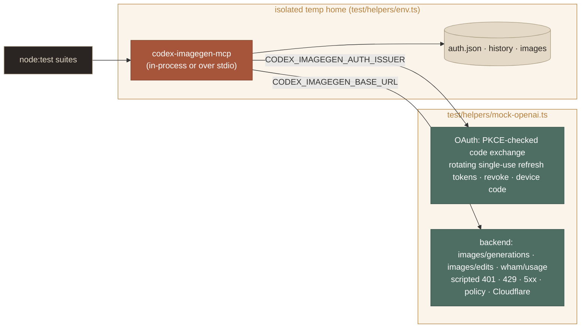

<p align="center">
  
</p>

# Development

Build it, test it without touching OpenAI, test it live, and ship it.

**On this page:** [Setup](#setup) · [Layout](#layout) · [Tests](#tests) · [Live testing](#live-testing) · [Conventions](#conventions) · [Artwork](#artwork) · [Updating from upstream Codex](#updating-from-upstream-codex) · [Release checklist](#release-checklist)

## Setup

```bash
npm install
npm run build        # tsc → dist/, marks dist/src/cli.js executable
npm test             # build + the node:test suite (Node ≥ 22 for the glob runner)
npm run typecheck
npm link             # optional: expose `codex-imagegen-mcp` globally for manual testing
```

## Layout

```text
src/             TypeScript sources (see ARCHITECTURE.md)
test/            node:test suites; test/helpers/mock-openai.ts mocks auth.openai.com + the ChatGPT backend
skill/imagegen/  the Agent Skill shipped with the server
upstream/        byte-exact copy of the Codex skill it was adapted from
scripts/         compose-doc-art.py builds docs/assets from raw generations
docs/            this documentation; docs/assets holds the artwork
```

## Tests

The suite never talks to OpenAI. Every test runs against a scriptable mock and an isolated temp home:



- **The mock behaves like the real service where it matters.** It checks the PKCE `code_verifier` against the challenge and the `redirect_uri`, and its refresh tokens are **single-use**: a second use returns `refresh_token_reused`, just as OpenAI does.
- **Scripting failures:** queue responses in `state.imageQueue` to simulate 401, 429, 5xx, policy and Cloudflare errors, and set delays to exercise timeouts and locking.
- **Nothing real is touched.** `test/helpers/env.ts` builds an isolated `CODEX_IMAGEGEN_*` environment in a temp directory, so tests never read or write your credentials. The installer tests also point `HOME` and `XDG_CONFIG_HOME` at temp directories.

| Suite | Covers |
|---|---|
| `auth-primitives` | JWT claims, PKCE, authorize URL, the 0600 store, the cross-process lock, stale locks |
| `auth-manager` | Refresh (three concurrent processes → one refresh), permanent vs transient failures, borrowed sources, 401 recovery, revoke |
| `login-flows` | Browser round trip, state mismatch, authorize errors, failed exchange, cancel, timeout, device code |
| `images-client` | Exact request body and headers, edits, retries, usage limits, policy/invalid/Cloudflare mapping, the usage API |
| `image-processing` | Codec, previews, chroma key, output planning, no-overwrite writes, input validation |
| `install` | JSONC-preserving opencode edits, backups, idempotency, conflict protection, uninstall, snippets |
| `server` | Full MCP over stdio: tools, resources, prompts, progress, errors, sign-in via the tool and then generation |
| `cli` | Every command end to end against the mock |

## Live testing

> [!CAUTION]
> These commands use your real ChatGPT quota. `status`, `doctor` and `auth_status` are free; every generated image counts.

```bash
node dist/src/cli.js status                        # auth + usage, no quota
node dist/src/cli.js generate "a red apple" -o tmp/live/apple.png
node dist/src/cli.js install opencode && opencode mcp list
opencode run -m openai/gpt-5.5 "make a transparent sticker of a cactus, save to assets/cactus.png"
opencode run -m github-copilot/claude-sonnet-5 "…"  # Copilot providers take a different media path in opencode
```

`tmp/` is git-ignored. To see what the server did inside a client, set `CODEX_IMAGEGEN_LOG_LEVEL=debug` and read `~/.local/share/codex-imagegen-mcp/server.log`.

## Conventions

- **stdout is the protocol.** Never write to it from server code paths.
- **Errors carry the next step.** Raise `ImagegenError(kind, message)`; each kind maps to that step in `describeError`.
- **Limits live in descriptions too.** Some clients strip schema constraints before the model sees them.
- **Claims about the backend must be measured.** Record them in [Backend](BACKEND.md) with the date.
- **The skill tracks upstream.** Diff changes against `upstream/codex-imagegen-skill/` and keep the prompting guidance aligned.

## Artwork

Every image in the docs was generated with this server, following the art-direction record in [docs/assets](assets/README.md). The raw generations stay out of git (about 2 MB each). `scripts/compose-doc-art.py` turns them into the committed assets:

```bash
# 1. regenerate any source with the prompts in docs/assets/README.md, saving into tmp/art/
# 2. rebuild every committed asset (Pillow + numpy; Superclarendon ships with macOS)
python3 scripts/compose-doc-art.py --art tmp/art --out docs/assets
```

The script does five things:
- **Snaps alpha.** The service returns 251–254 inside opaque areas; this rounds it to 255.
- **Typesets wording locally.** Poster titles are set in Superclarendon, so no text is ever generated.
- **Slices the badge grid** into six PNGs.
- **Builds the showcase sheets.**
- **Writes the social preview.**

Paper grain is seeded, so reruns are byte-stable.

## Updating from upstream Codex

1. **Extract the current skill:** `CODEX_HOME=$(mktemp -d) /Applications/ChatGPT.app/Contents/Resources/codex debug prompt-input hi >/dev/null`. This installs the embedded system skills into `$CODEX_HOME/skills/.system/`.
2. **Diff and port.** Compare that `imagegen/` with `upstream/codex-imagegen-skill/`, update the copy, and port the relevant guidance into `skill/imagegen/`.
3. **Check the tool.** Look at `codex-rs/ext/image-generation/src/tool.rs` upstream for changes to the request body, model id or limits.

## Release checklist

1. `npm test` passes and `npm run typecheck` is clean.
2. Live smoke test: `status`, one `generate`, one `edit` with `-b transparent`, `doctor`.
3. opencode: `install opencode`, `opencode mcp list`, one `opencode run`.
4. Bump `version` in `package.json` and add a `CHANGELOG.md` entry.
5. `npm pack --dry-run` includes `dist/src`, `skill`, `docs/*.md`, `README.md`, `LICENSE` and `NOTICE`. The artwork is excluded to keep the package small.

---

<p align="center"><a href="ARCHITECTURE.md">← Architecture</a> &nbsp;·&nbsp; <a href="README.md">Docs home</a> &nbsp;·&nbsp; <a href="../README.md">README</a></p>
