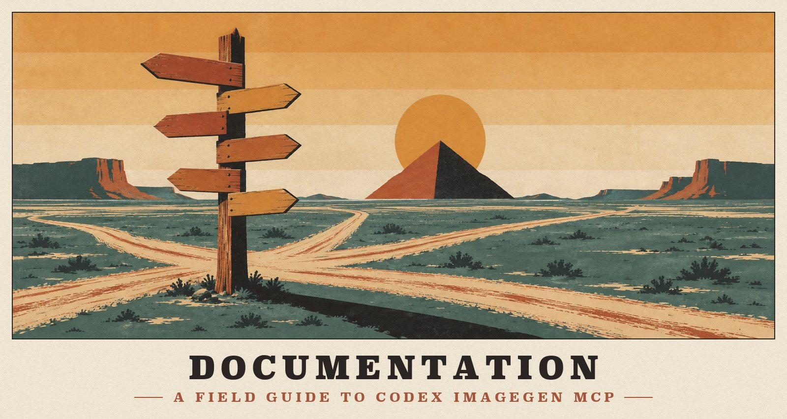
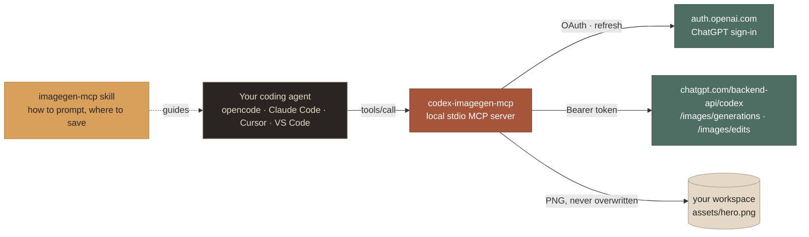

  

# Documentation

codex-imagegen-mcp puts the image generation of OpenAI Codex into any MCP client, running on your ChatGPT plan. These pages cover how to use it, how it signs in, where it plugs in, and how it works.

<table>
  <tr>
    <td width="33%" valign="top">
       
      <b>1 · <a href="TOOLS.md">Tools</a></b> 
      Parameters, results, resources, prompts, errors, progress and timeouts.
    </td>
    <td width="33%" valign="top">
       
      <b>2 · <a href="AUTH.md">Authentication</a></b> 
      Browser and device-code sign-in, token storage and rotation, borrowing, security.
    </td>
    <td width="33%" valign="top">
       
      <b>3 · <a href="CLIENTS.md">Clients</a></b> 
      The interactive installer and 25+ tools: config files, timeouts, skill folders, per-tool notes.
    </td>
  </tr>
  <tr>
    <td width="33%" valign="top">
       
      <b>4 · <a href="BACKEND.md">Backend</a></b> 
      The Codex skill and built-in tool, the HTTP API, and what the service really honors.
    </td>
    <td width="33%" valign="top">
       
      <b>5 · <a href="ARCHITECTURE.md">Architecture</a></b> 
      Module map, request flow, and the reasoning behind each design decision.
    </td>
    <td width="33%" valign="top">
       
      <b>6 · <a href="DEVELOPMENT.md">Development</a></b> 
      Build, the mock-backed test suite, live testing, artwork, the release pipeline.
    </td>
  </tr>
</table>

## Where to start

| If you want to… | Read |
|---|---|
| Install it and make a first image | The [README quick start](../README.md#quick-start), then [Tools](TOOLS.md) |
| Know how it signs in, and whether that's safe | [Authentication](AUTH.md) |
| Set it up in your coding tools, or add a new one | [Clients](CLIENTS.md), then [INSTALLER.md](INSTALLER.md) for the design |
| Understand what Codex does under the hood | [Backend](BACKEND.md) |
| Change the code | [Architecture](ARCHITECTURE.md), then [Development](DEVELOPMENT.md) |
| Cut a release, or check how one was built | [Development › Releasing](DEVELOPMENT.md#releasing) and [Release integrity](../.github/SECURITY.md#release-integrity) |

## At a glance

## About the artwork

Every picture in these docs was generated **with codex-imagegen-mcp itself**, using the skill it ships: the poster banners, the badges, the logo and the examples. The installer screenshots are real terminal output. The series follows one art direction, a 1930s WPA silkscreen travel poster in five flat inks. [The prompts, the direction record and how to rebuild the assets →](assets/README.md)

---

<a href="../README.md">← Back to the README</a> &nbsp;·&nbsp; <a href="TOOLS.md">Start with Tools →</a>

