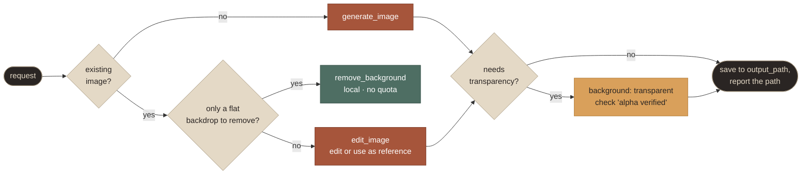
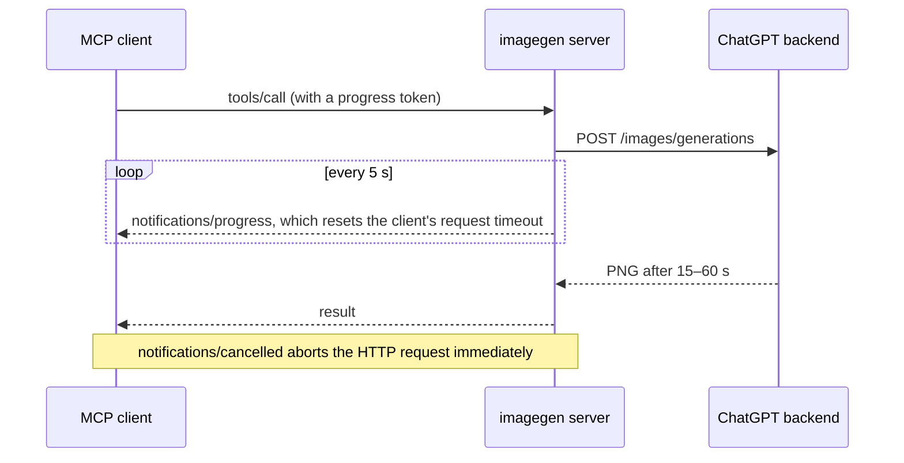

<p align="center">
  
</p>

# Tools

The server exposes **five tools**, three **resources** and two **prompts**. This page documents every parameter, every result field and every error.

**On this page:** [Choosing a tool](#choosing-a-tool) · [generate_image](#generate_image) · [edit_image](#edit_image) · [remove_background](#remove_background) · [auth_status](#auth_status) · [sign_in](#sign_in) · [Errors](#errors) · [Resources](#resources) · [Prompts](#prompts) · [Progress, timeouts and cancellation](#progress-timeouts-and-cancellation)

| Tool | Purpose | Network | Quota |
|---|---|---|---|
| [`generate_image`](#generate_image) | A new image from a text prompt | ChatGPT | 1 image per variant |
| [`edit_image`](#edit_image) | Edit images, or generate guided by 1–5 references | ChatGPT | 1 image per variant |
| [`remove_background`](#remove_background) | Key out a flat, solid-colour backdrop | none | none |
| [`auth_status`](#auth_status) | Sign-in, plan, credential source, usage windows | ChatGPT (usage only) | none |
| [`sign_in`](#sign_in) | Start a ChatGPT sign-in and return a link or code | OpenAI auth | none |

The server's name in client configs defaults to `imagegen`, and clients add a prefix to the tool names:

| Client | Tool name as the model sees it |
|---|---|
| opencode | `imagegen_generate_image` |
| Claude Code, OpenAI Codex | `mcp__imagegen__generate_image` |
| Other clients | listed under the `imagegen` server |

> [!NOTE]
> **Relative paths** resolve against the **workspace root**. That is the first `file://` root the client reports through MCP roots (opencode reports the project directory). Without one, the server uses the directory it was started in. A filesystem root such as `/` falls back to your home directory.

## Choosing a tool



## generate_image

Generate a new image from a text prompt. The server calls `POST https://chatgpt.com/backend-api/codex/images/generations`.

| Parameter | Type | Default | Description |
|---|---|---|---|
| `prompt` | string, 1–32 000 chars | required | The image description. Structure it: use case, subject, style, composition, lighting, palette, exact text in quotes, constraints. |
| `aspect_ratio` | enum | `auto` | `1:1` `4:5` `5:4` `4:3` `3:4` `3:2` `2:3` `16:9` `9:16` `21:9` `9:21`. Appended to the prompt as, for example, `Aspect ratio: 16:9, wide landscape (horizontal) canvas.` |
| `background` | enum | `auto` | `transparent` returns a PNG with real alpha. `opaque` asks for a filled background. |
| `n` | int, 1–4 | `1` | Variants of the *same* prompt, sent as concurrent requests. Each counts against the quota. |
| `output_path` | string | image library | A `.png`, `.jpg` or `.jpeg` file, or a directory (existing, or ending in `/`). With `n > 1`, `-1`, `-2`… is inserted before the extension. |
| `output_format` | `png` · `jpeg` | `png` | JPEG is converted locally, flattened on white, and can't be transparent. It's inferred from the `output_path` extension. |
| `overwrite` | bool | `false` | When false, an existing file is never replaced; the next free `name-2.png`, `name-3.png`… is used. |
| `include_preview` | bool | `true` | Attach a JPEG preview (longest edge 1024 px, transparency shown as a checkerboard). |

> [!TIP]
> The service picks the pixel size itself and sizes the canvas from the prompt. Measured results: `16:9` → 1672×941, `9:16` → 941×1672, `21:9` → 1916×821, `1:1` → 1254×1254. For exact dimensions, generate the closest ratio, then resize or crop locally.

> [!NOTE]
> `background: "opaque"` is a **hint**. In one measured case the service returned a transparent PNG when the prompt described a backdrop that "will be keyed out", even though `opaque` was sent. If you need a filled background, describe it as part of the picture.

**Default location** (no `output_path`): `$CODEX_IMAGEGEN_OUTPUT_DIR`, which defaults to `~/.local/share/codex-imagegen-mcp/images`, in `/YYYY-MM-DD/HHMMSS-<prompt-slug>.png`.

**The result has three parts:**

1. **Text.** One line per saved file (path, dimensions, format, size, background, id), then any warnings, then guidance for the model.
2. **Image blocks.** One preview per saved file, when `include_preview` is on.
3. **`structuredContent`**, validated against the declared `outputSchema`:

```json
{
  "images": [
    { "id": "img_aa289474550c", "path": "/abs/project/assets/hero.png", "mime_type": "image/png",
      "bytes": 2063882, "width": 1672, "height": 941, "background": "opaque" }
  ],
  "prompt": "…the exact prompt sent, including the aspect-ratio line…",
  "elapsed_ms": 22834,
  "failures": [],
  "warnings": []
}
```

When transparency was requested, each image also carries `transparent: true|false`. It records whether the decoded PNG actually contains non-opaque pixels, which is what the text reports as *alpha verified*.

**Partial success:** with `n > 1`, finished variants are saved and returned, and failed ones are listed in `failures`. The call is an error (`isError: true`) only if nothing was produced.

## edit_image

Edit images, or generate using reference images. The server calls `POST https://chatgpt.com/backend-api/codex/images/edits` with the images inlined as data URLs. It takes every `generate_image` parameter, plus:

| Parameter | Type | Description |
|---|---|---|
| `images` | string[], 1–5 | Local paths (absolute, `~/…`, workspace-relative), `file://` URLs, `http(s)://` URLs (downloaded with a 60 s timeout), or `data:image/…;base64,…`. PNG, JPEG or WebP, up to 15 MB each, detected by magic bytes. |

- `images[0]` is **Image 1**, the primary edit target. Refer to the inputs by index in the prompt, and spell out what must stay unchanged.
- The input files are never modified.
- To iterate on a result, pass the previous output path as Image 1.

```text
Image 1: add a tiny woven straw hat on top of the cactus, tilted slightly.
Keep the cactus, flowers, pot, outline and transparent background exactly unchanged.
```

## remove_background

A local chroma-key cutout, ported to TypeScript from the Codex skill's `scripts/remove_chroma_key.py`. It uses the same algorithm, makes no network call and costs no quota.

| Parameter | Type | Default | Description |
|---|---|---|---|
| `input_path` | string | required | PNG or JPEG |
| `output_path` | string (`.png`) | `<input>-transparent.png` | Never overwrites unless `overwrite: true` |
| `key_color` | `#rrggbb` | auto | When omitted, the median of a 6 px border band |
| `soft_matte` | bool | `true` | Smoothstep alpha between `transparent_threshold` and `opaque_threshold`, combined with key-channel dominance |
| `despill` | bool | `true` | Caps key-coloured channels on semi-transparent pixels |
| `tolerance` | 0–255 | `12` | Hard key (`soft_matte: false`): the maximum per-channel distance treated as background |
| `transparent_threshold` | 0–255 | `12` | Soft matte: at or below this distance a pixel is fully transparent |
| `opaque_threshold` | 0–255 | `96` | Soft matte: at or above this distance a pixel is fully opaque |
| `edge_contract` | 0–16 | `0` | Erode the matte N px (3×3 minimum filter) to remove halos |
| `edge_feather` | 0–64 | `0` | Gaussian blur radius for the alpha edge |
| `overwrite`, `include_preview` | bool | `false`, `true` | As above |

The result reports the key colour it used and the percentage of fully transparent and soft-edge pixels. It warns when nothing matched the key, or when more than 97% of the image became transparent.

<p align="center">
  
  <br><sub>Real run: key auto-detected as <code>#03f902</code> · 63.8% fully transparent · 0.4% soft edge pixels.</sub>
</p>

## auth_status

| Parameter | Default | Description |
|---|---|---|
| `check_usage` | `true` | Also fetch `GET /backend-api/wham/usage` (free) for the usage windows |

The text report covers:
- the active source, account email, plan and account suffix;
- when the token expires;
- the usage windows, e.g. `Codex 5-hour window: 6% used, resets in 32m`;
- any sign-in in progress, and the outcome of the last one;
- every credential source with its state: `✓` ready, `·` missing, `✗` expired or unusable, `-` disabled.

## sign_in

| Parameter | Default | Description |
|---|---|---|
| `method` | `browser` | `browser`: an authorize link that redirects to `http://localhost:1455` on this machine. `device`: a code to enter at `https://auth.openai.com/codex/device` from any device. |
| `open_browser` | `true` | Try to open the link on this machine |
| `force` | `false` | Start a new sign-in even when one already exists, e.g. to switch account or workspace |

The tool returns the link or code **immediately**, and the sign-in completes in the background. Only one sign-in runs at a time, so a second call returns the pending one. The model should relay the link or code verbatim, then call `auth_status` to confirm. [How sign-in works →](AUTH.md)

## Errors

Errors come back as `isError: true` results. The text states both the problem and the next step:

| Kind | Typical message → next step |
|---|---|
| `not_signed_in` | *Not signed in to ChatGPT. Sign in by running `… login` … or call the `sign_in` tool* |
| `session_expired` | *Your sign-in was invalidated … Please sign in again.* |
| `auth_failed` | HTTP 401 means the credentials were rejected; 403 means the plan or workspace lacks the feature |
| `usage_limit` | *You've hit your ChatGPT image-generation usage limit (plus plan). It resets in 1h 12m …* → don't retry |
| `content_policy` | *The request was rejected by OpenAI's safety system: …* → rephrase |
| `invalid_request` · `invalid_input` · `unsupported` | Bad parameters, paths, formats or sizes → fix the arguments |
| `server_error` · `network` · `timeout` | Transient. The server already retried 5xx and network errors twice (after 1 s and 3 s), so one more try is reasonable |
| `blocked` | A Cloudflare challenge → try later or from another network |

The ChatGPT request id (`x-codex-imagegen-request-id`) is appended when available.

## Resources

| URI | Type | Content |
|---|---|---|
| `imagegen://history` | `application/json` | The 50 most recent saved images, newest first: id, time, tool, path, size, prompt, inputs, request ids |
| `imagegen://images/{id}` | image blob | The saved file, or a 2048 px JPEG preview if it is larger than 8 MB. The listing shows the 25 most recent. |
| `imagegen://skill/SKILL.md`, `imagegen://skill/references/*.md` | `text/markdown` | The bundled skill, for clients without Agent Skills support |

History is also appended to `$CODEX_IMAGEGEN_HOME/history.jsonl`.

## Prompts

| Prompt | Arguments | Expands to |
|---|---|---|
| `generate` | `description` | A request to use `generate_image` with the skill's workflow checklist |
| `edit` | `image`, `change` | A request to use `edit_image` with invariant-preserving instructions |

In opencode they appear as `/imagegen:generate` and `/imagegen:edit`.

## Progress, timeouts and cancellation



- **Progress:** while a request runs, the server sends a progress notification every 5 s, provided the client supplied a progress token. opencode supplies one and resets its request timeout on each notification (`resetTimeoutOnProgress`), so 15–60 s generations never hit its 60 s default.
- **Timeout:** the backend request itself times out after `CODEX_IMAGEGEN_TIMEOUT_MS`, 300 s by default.
- **Cancellation:** cancelling the tool call aborts the HTTP request.

---

<p align="center"><a href="README.md">← Docs home</a> &nbsp;·&nbsp; <a href="AUTH.md">Authentication →</a></p>
