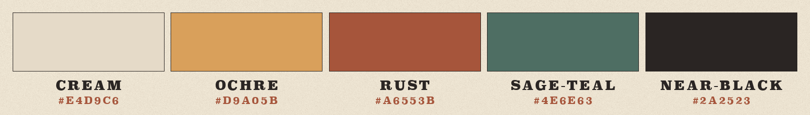

<p align="center">
  
</p>

# The artwork

Every image in this repository was generated with **codex-imagegen-mcp itself**: the posters, banners, badges, logo and examples. The tools ran from opencode, following the `imagegen` skill this project ships. Nothing was drawn by hand, and nothing is stock. The only local steps were deterministic: typesetting, cropping, slicing and compression, all done by [`scripts/compose-doc-art.py`](../../scripts/compose-doc-art.py).

That makes this page both the art credits and a worked example of the tools on a real, multi-asset job: **15 generations and one local `remove_background` call**, about 5% of a ChatGPT Plus 5-hour window.

## Art direction

The series was art-directed before any pixel was generated. A seeded, deterministic procedure chose one movement, palette and type voice, so the docs read as one family rather than a pile of AI defaults:

```text
DIRECTION G13 · PALETTE C07 · TYPE T06 — WHY: docs as a travel-poster series, the opposite of dark-tech glow
```

| | Decision |
|---|---|
| **Movement** | *G13*: 1930s WPA silkscreen travel poster. Flat opaque inks, crude stepped-band skies, monumental simplified landforms, low horizon, one long diagonal shadow, slight misregistration, paper grain. |
| **Palette** | *C07 Desert Modern*. Cream and ochre ground (~60%), rust and sage-teal masses (~30%), near-black accent (~10%). |
| **Type** | *T06*: bracketed slab serif (Superclarendon), letterspaced caps. It's always **typeset locally**; no wording is ever generated. |
| **Idea** | The docs are destinations in one landscape, and images appear in that world. Each page banner is one landmark: a signpost, gatehouse, tools, railway junction, dam, viaduct or surveyor's camp. |
| **Family** | One master mark. Every sibling repeats a hard ochre sun rising behind a chevron peak on the horizon, and only composition, crop, format and the page landmark vary. |
| **Rejected** | *G12* raw web: its identity is default text and 1px rules, which vanish at 16 px. *PH03–PH16* photography: fails the logo gate. *I12* gouache: eligible, but scored 7 against G13's 9. |

<p align="center"></p>

The logo was built first, as the hardest constraint, and checked at 16, 24 and 32 px, in greyscale and as a one-ink silhouette before anything else was made.

## How the set was produced

| Step | Tool | Why |
|---|---|---|
| Logo | `generate_image` · transparent | The family master |
| Hero | `generate_image` · 21:9 | Establishes the scene grammar |
| Seven banners | `edit_image` with the hero as a **style reference** | The strongest consistency across a series. The reference fixes inks, sky and texture; the prompt changes the landmark |
| Badges | `edit_image` with the logo as reference, **one 3×2 grid** | Six icons in one call share stroke, ring and scale; the script slices them |
| Aspect-ratio demo | `generate_image` · the same prompt at 1:1, 16:9, 9:16 | Shows reframing, not cropping |
| Background-removal demo | `generate_image` on flat `#00FF00`, then `remove_background` | Shows the local chroma key |
| Real session | Agent-written prompts in opencode (GPT-5.5, Claude Sonnet 5) | Proof in the wild, unretouched |

## Inventory

| File | From | Notes |
|---|---|---|
| `logo.png` | logo master | 512 px, alpha snapped to 255, palette-quantized |
| `hero.jpg`, `social-preview.jpg` | hero | Poster margin + typeset title; the social card is 1280×640 |
| `banner-*.jpg`, `thumbs/banner-*.jpg` | seven banners | 1600 px posters and 640 px card thumbnails |
| `badges/*.png` | badge grid | Sliced along transparent gutters, 256 px each |
| `palette.png` | — | Drawn locally from the palette hexes |
| `examples/aspect-ratios.jpg` | three ratio generations | Contact sheet with typeset labels |
| `examples/remove-background.jpg`, `examples/balloon-cutout.png` | balloon + `remove_background` | Before/after, plus the real transparent cutout |
| `examples/real-session.jpg` | two opencode sessions | Transparency shown as a checkerboard |

> [!NOTE]
> Committed assets are re-encoded, so they no longer carry the C2PA provenance manifest the service embeds in every PNG. The raw generations keep it.

## Rebuilding

1. Regenerate a source with the exact prompt below, using the same tool and parameters, and save it under `tmp/art/`. The session images go in `tmp/art/session/`.
2. Run `python3 scripts/compose-doc-art.py --art tmp/art --out docs/assets`. It needs Pillow and numpy, and the Superclarendon font that ships with macOS.

The service decides the final pixels, so a regeneration will differ in detail while keeping the direction.

## Prompts

These are exactly as sent, including the aspect-ratio line the server appends. Each summary shows the output size, the generation time and the committed file it feeds.

<details>
<summary><b>Logo — family master</b> · 1254×1254 · 44 s → <code>logo.png</code></summary>

`generate_image` · `aspect_ratio: 1:1` · `background: transparent`

```text
DIRECTION G13 · PALETTE C07 · TYPE T06 · ASSET 1/16 (family master) — WHY: docs as a travel-poster series, the opposite of dark-tech glow
PURPOSE: the logo and app icon of "codex-imagegen-mcp", an image-generation tool for coding agents; it must read at 16 px and at 512 px.
SUBJECT: a round national-park-style emblem. Inside a thick near-black outer ring: a bold symmetric mountain peak shaped like an upward chevron (a caret), its lit left face rust and its shadow right face near-black; a large flat ochre sun disc rising directly behind the peak; a sage-teal ground band across the bottom; the sky behind is two crude stepped cream bands.
COMPOSE: centred emblem with a perfectly circular outer silhouette filling about 90% of the canvas; peak apex near the centre; only four large shapes (ring, sun, peak, ground) with strong figure/ground contrast so it still reads at 16 px.
FORMAT: 1:1, transparent background outside the circle.
LOOK: 1930s WPA silkscreen travel-poster emblem. Flat opaque inks only: ochre #D9A05B, rust #A6553B, cream #E4D9C6, sage-teal #4E6E63, near-black #2A2523. Every shape is a single flat ink with no modelling; the sun is a hard-edged flat disc; thick uniform borders; very slight 1 mm misregistration between inks; faint paper grain only inside the cream sky.
TEXT: none — the emblem carries no letters, numbers or extra symbols; the four shapes carry all the meaning.
EXCLUDE: smooth gradients (use flat stepped bands), glow or lens flare (hard flat disc), gloss, bevels or 3D (matte flat ink), thin lines or tiny details (four large shapes only), any shadow or backdrop outside the circle (transparent surround).

Aspect ratio: 1:1, square canvas.
```

</details>

<details>
<summary><b>Hero poster</b> · 1916×821 · 24 s → <code>hero.jpg, social-preview.jpg</code></summary>

`generate_image` · `aspect_ratio: 21:9` · `background: opaque`

```text
DIRECTION G13 · PALETTE C07 · TYPE T06 · ASSET 2/16 (hero, sibling of the sun-and-peak master) — WHY: the README as the destination poster; an image appears in the landscape
PURPOSE: wide hero banner at the top of the README of codex-imagegen-mcp, a tool that lets coding agents create images.
SUBJECT: a vast desert plain at sunrise. On the far horizon, the family emblem as landscape: one bold symmetric chevron peak (lit left face rust, shadow right face near-black) with a huge hard ochre sun disc rising directly behind its apex. In the midground, slightly right of centre, an enormous empty wooden picture frame stands upright on the plain like a monument; its opening frames the peak and the sun exactly. A single straight railway line runs from the lower-left foreground to the foot of the frame, with one small locomotive and one boxcar on it for scale.
COMPOSE: low horizon at the lower third; the frame casts one long flat near-black diagonal shadow toward the lower right; low flat mesas at both far edges; broad calm sky above; nothing important within the outer 6% of the edges.
FORMAT: 21:9 panoramic, opaque.
LOOK: 1930s WPA silkscreen travel poster, five flat opaque inks only: cream #E4D9C6, ochre #D9A05B, rust #A6553B, sage-teal #4E6E63, near-black #2A2523. The sky is five crude horizontal stepped bands from cream at the horizon to ochre at the top. Monumental simplified landforms, each shape a single flat ink with no modelling; lit faces to the left, shadow faces as flat near-black planes to the right. Sage-teal carries the foreground plain and the mesa shadows, about a fifth of the image. Slight 1-2 mm ink misregistration; uncoated paper grain in the cream areas.
TEXT: none — no letters, numbers, signs or logos anywhere; flat ink shapes carry all the meaning.
EXCLUDE: smooth gradients (stepped bands instead), glow, lens flare or god rays (hard flat sun disc), photographic or 3D rendering (flat screen-printed shapes), people or crowds (one small train only), clutter (one frame, one train, one peak).

Aspect ratio: 21:9, ultra-wide landscape (horizontal) canvas.
```

</details>

<details>
<summary><b>Feature badges (one 3×2 grid)</b> · 1254×1254 · 48 s → <code>badges/*.png</code></summary>

`edit_image` · `images: [logo-master.png]` (style reference) · `aspect_ratio: 1:1` · `background: transparent`

```text
DIRECTION G13 · PALETTE C07 · TYPE T06 · ASSET 3/16 (badge grid, sibling of the sun-and-peak master) — WHY: feature badges as park patches from the same poster series
PURPOSE: six feature badges for a README feature grid, displayed at 80-120 px each.
INPUT: Image 1 is the family master emblem. Use it as the exact style and construction reference (ring thickness, inks, stepped cream sky, flat ochre sun, sage-teal ground band, paper grain). Do not reproduce it as a seventh badge.
SUBJECT: six round badges built exactly like Image 1, except that the mountain peak is replaced by ONE bold object standing large on the sage-teal ground, its lit face rust or ochre and its shadow face flat near-black: 1 an old iron key; 2 an electrical plug with a short curled cord; 3 a pair of open scissors; 4 two overlapping empty picture frames, one wide and one tall; 5 a neat stack of three framed pictures, slightly offset; 6 an open book. Every badge keeps a small hard ochre sun disc behind its object.
COMPOSE: a 3x2 grid — row 1: key, plug, scissors; row 2: frames, stack, book. Identical badge diameter and ring thickness, identical object size, wide transparent gutters, every badge fully inside its own cell.
FORMAT: 1:1, transparent background around and between the badges.
LOOK: 1930s WPA silkscreen with the same five flat opaque inks as Image 1: cream #E4D9C6, ochre #D9A05B, rust #A6553B, sage-teal #4E6E63, near-black #2A2523. Every shape is one flat ink with thick uniform edges and no modelling; slight 1 mm misregistration; faint paper grain only in the cream.
TEXT: none — no letters or numbers on any badge or object.
EXCLUDE: gradients (flat stepped bands), glow, gloss or 3D (matte flat ink), thin lines or tiny details (one bold object per badge), badges touching or overlapping (wide gutters), any backdrop behind the grid (transparent).

Aspect ratio: 1:1, square canvas.
```

</details>

<details>
<summary><b>Banner — Documentation</b> · 1916×821 · 28 s → <code>banner-docs.jpg</code></summary>

`edit_image` · `images: [hero.png]` (style reference) · `aspect_ratio: 21:9`

```text
DIRECTION G13 · PALETTE C07 · TYPE T06 · ASSET 5/16 (docs-index banner, sibling of the sun-and-peak master) — WHY: each doc page is one destination in the same poster series
PURPOSE: wide banner at the top of the documentation index of codex-imagegen-mcp.
INPUT: Image 1 is the series hero. Use it ONLY as the style reference — match its five inks, crude stepped-band sky, flat-shape grammar, paper grain and misregistration exactly. Do not copy its picture frame, railway or train.
SUBJECT: a tall wooden trail signpost at a desert crossroads with six arrow-shaped boards pointing in different directions; each board is a plain flat rust or ochre plank with no markings. Four dirt roads fan out from the crossroads across the plain toward distant flat mesas. On the far horizon, the series emblem: one bold symmetric chevron peak (lit left face rust, shadow right face near-black) with a hard flat ochre sun disc rising directly behind its apex.
COMPOSE: signpost large at the left third, roads fanning out toward the right; low horizon at the lower third; one long flat near-black diagonal shadow falls toward the lower right; nothing important within the outer 6% of the edges.
FORMAT: 21:9 panoramic, opaque.
LOOK: 1930s WPA silkscreen travel poster, five flat opaque inks only: cream #E4D9C6, ochre #D9A05B, rust #A6553B, sage-teal #4E6E63, near-black #2A2523. Sky in five crude horizontal stepped bands, cream at the horizon to ochre at the top. Every shape is one flat ink with no modelling; lit faces left, shadow faces as flat near-black planes right; sage-teal carries the foreground plain (about a fifth of the image); slight 1-2 mm misregistration; uncoated paper grain in the cream.
TEXT: none — no letters, numbers, arrows symbols, signs or logos anywhere; the blank boards and flat shapes carry all the meaning.
EXCLUDE: smooth gradients (stepped bands), glow or lens flare (hard flat sun), photographic or 3D rendering (flat screen-printed shapes), people (the signpost alone), clutter (one signpost, one peak, one sun).

Aspect ratio: 21:9, ultra-wide landscape (horizontal) canvas.
```

</details>

<details>
<summary><b>Banner — Authentication</b> · 1916×821 · 38 s → <code>banner-auth.jpg</code></summary>

`edit_image` · `images: [hero.png]` · `aspect_ratio: 21:9`

```text
DIRECTION G13 · PALETTE C07 · TYPE T06 · ASSET 6/16 (authentication banner, sibling of the sun-and-peak master) — WHY: each doc page is one destination in the same poster series
PURPOSE: wide banner at the top of the "Authentication" page of the codex-imagegen-mcp documentation.
INPUT: Image 1 is the series hero. Use it ONLY as the style reference — match its five inks, crude stepped-band sky, flat-shape grammar, paper grain and misregistration exactly. Do not copy its picture frame, railway or train.
SUBJECT: a squat stone gatehouse with a heavy wooden gate swung wide open across a straight desert road; the road runs from the lower-left foreground through the open gate toward the horizon; a giant old iron key, taller than the gate, leans against the gatehouse wall. On the far horizon, the series emblem: one bold symmetric chevron peak (lit left face rust, shadow right face near-black) with a hard flat ochre sun disc rising directly behind its apex.
COMPOSE: gatehouse and key at the left third, the road leading the eye to the peak; low horizon at the lower third; one long flat near-black diagonal shadow falls toward the lower right; nothing important within the outer 6% of the edges.
FORMAT: 21:9 panoramic, opaque.
LOOK: 1930s WPA silkscreen travel poster, five flat opaque inks only: cream #E4D9C6, ochre #D9A05B, rust #A6553B, sage-teal #4E6E63, near-black #2A2523. Sky in five crude horizontal stepped bands, cream at the horizon to ochre at the top. Every shape is one flat ink with no modelling; lit faces left, shadow faces as flat near-black planes right; sage-teal carries the foreground plain (about a fifth of the image); slight 1-2 mm misregistration; uncoated paper grain in the cream.
TEXT: none — no letters, numbers, signs or logos anywhere; flat shapes carry all the meaning.
EXCLUDE: smooth gradients (stepped bands), glow or lens flare (hard flat sun), photographic or 3D rendering (flat screen-printed shapes), people (the gatehouse alone), clutter (one gatehouse, one key, one peak, one sun).

Aspect ratio: 21:9, ultra-wide landscape (horizontal) canvas.
```

</details>

<details>
<summary><b>Banner — Tools</b> · 1916×821 · 28 s → <code>banner-tools.jpg</code></summary>

`edit_image` · `images: [hero.png]` · `aspect_ratio: 21:9`

```text
DIRECTION G13 · PALETTE C07 · TYPE T06 · ASSET 7/16 (tools banner, sibling of the sun-and-peak master) — WHY: each doc page is one destination in the same poster series
PURPOSE: wide banner at the top of the "Tools" page of the codex-imagegen-mcp documentation.
INPUT: Image 1 is the series hero. Use it ONLY as the style reference — match its five inks, crude stepped-band sky, flat-shape grammar, paper grain and misregistration exactly. Do not copy its picture frame, railway or train.
SUBJECT: five colossal tools planted upright in the desert plain like monuments in one evenly spaced row, each as tall as a mesa and each a single bold flat silhouette: a paintbrush, a pencil, a pair of open scissors, a round surveyor's compass on a short post, and an old iron key. On the far horizon, the series emblem: one bold symmetric chevron peak (lit left face rust, shadow right face near-black) with a hard flat ochre sun disc rising directly behind its apex, visible in the wide gap at the centre of the row.
COMPOSE: the row of five tools spans the middle of the frame with a wider gap at the centre framing the peak and sun; low horizon at the lower third; each tool casts one long flat near-black diagonal shadow toward the lower right; nothing important within the outer 6% of the edges.
FORMAT: 21:9 panoramic, opaque.
LOOK: 1930s WPA silkscreen travel poster, five flat opaque inks only: cream #E4D9C6, ochre #D9A05B, rust #A6553B, sage-teal #4E6E63, near-black #2A2523. Sky in five crude horizontal stepped bands, cream at the horizon to ochre at the top. Every shape is one flat ink with no modelling; lit faces left, shadow faces as flat near-black planes right; sage-teal carries the foreground plain (about a fifth of the image); slight 1-2 mm misregistration; uncoated paper grain in the cream.
TEXT: none — no letters, numbers, signs or logos anywhere; flat shapes carry all the meaning.
EXCLUDE: smooth gradients (stepped bands), glow or lens flare (hard flat sun), photographic or 3D rendering (flat screen-printed shapes), people (the tools alone), clutter (five tools, one peak, one sun).

Aspect ratio: 21:9, ultra-wide landscape (horizontal) canvas.
```

</details>

<details>
<summary><b>Banner — Clients</b> · 1916×821 · 39 s → <code>banner-clients.jpg</code></summary>

`edit_image` · `images: [hero.png]` · `aspect_ratio: 21:9`

```text
DIRECTION G13 · PALETTE C07 · TYPE T06 · ASSET 8/16 (clients banner, sibling of the sun-and-peak master) — WHY: each doc page is one destination in the same poster series
PURPOSE: wide banner at the top of the "Clients" page of the codex-imagegen-mcp documentation (one server, many coding tools).
INPUT: Image 1 is the series hero. Use it ONLY as the style reference — match its five inks, crude stepped-band sky, flat-shape grammar, paper grain and misregistration exactly. Do not copy its picture frame or its single train.
SUBJECT: a desert railway junction: five straight railway tracks converge from different directions across the plain into one small wooden station with a tall wooden water tower beside it. On the far horizon, the series emblem: one bold symmetric chevron peak (lit left face rust, shadow right face near-black) with a hard flat ochre sun disc rising directly behind its apex, directly above the station.
COMPOSE: tracks sweep in from the left edge, the bottom edge and the right edge and meet at the station in the centre; low horizon at the lower third; the water tower casts one long flat near-black diagonal shadow toward the lower right; nothing important within the outer 6% of the edges.
FORMAT: 21:9 panoramic, opaque.
LOOK: 1930s WPA silkscreen travel poster, five flat opaque inks only: cream #E4D9C6, ochre #D9A05B, rust #A6553B, sage-teal #4E6E63, near-black #2A2523. Sky in five crude horizontal stepped bands, cream at the horizon to ochre at the top. Every shape is one flat ink with no modelling; lit faces left, shadow faces as flat near-black planes right; sage-teal carries the foreground plain (about a fifth of the image); slight 1-2 mm misregistration; uncoated paper grain in the cream.
TEXT: none — no letters, numbers, signs or logos anywhere, including on the station; flat shapes carry all the meaning.
EXCLUDE: smooth gradients (stepped bands), glow or lens flare (hard flat sun), photographic or 3D rendering (flat screen-printed shapes), people and trains (empty tracks), clutter (one station, one tower, one peak, one sun).

Aspect ratio: 21:9, ultra-wide landscape (horizontal) canvas.
```

</details>

<details>
<summary><b>Banner — Backend</b> · 1916×821 · 24 s → <code>banner-backend.jpg</code></summary>

`edit_image` · `images: [hero.png]` · `aspect_ratio: 21:9`

```text
DIRECTION G13 · PALETTE C07 · TYPE T06 · ASSET 9/16 (backend banner, sibling of the sun-and-peak master) — WHY: each doc page is one destination in the same poster series
PURPOSE: wide banner at the top of the "Backend" page of the codex-imagegen-mcp documentation (how the service works under the hood).
INPUT: Image 1 is the series hero. Use it ONLY as the style reference — match its five inks, crude stepped-band sky, flat-shape grammar, paper grain and misregistration exactly. Do not copy its picture frame, railway or train.
SUBJECT: a monumental curved concrete dam spanning a canyon in the midground, with a blocky hydroelectric powerhouse at its base, flat still water in the reservoir behind it, and three steel lattice transmission towers marching away across the plain carrying power lines. On the far horizon above the dam, the series emblem: one bold symmetric chevron peak (lit left face rust, shadow right face near-black) with a hard flat ochre sun disc rising directly behind its apex.
COMPOSE: the dam spans the centre of the frame; the towers step toward the right edge; low horizon at the lower third; one long flat near-black diagonal shadow falls toward the lower right; nothing important within the outer 6% of the edges.
FORMAT: 21:9 panoramic, opaque.
LOOK: 1930s WPA silkscreen travel poster, five flat opaque inks only: cream #E4D9C6, ochre #D9A05B, rust #A6553B, sage-teal #4E6E63, near-black #2A2523. Sky in five crude horizontal stepped bands, cream at the horizon to ochre at the top. Every shape is one flat ink with no modelling; lit faces left, shadow faces as flat near-black planes right; sage-teal carries the foreground plain (about a fifth of the image); slight 1-2 mm misregistration; uncoated paper grain in the cream.
TEXT: none — no letters, numbers, signs or logos anywhere; flat shapes carry all the meaning.
EXCLUDE: smooth gradients (stepped bands), glow, sparks or lens flare (hard flat sun), photographic or 3D rendering (flat screen-printed shapes), people (the structures alone), clutter (one dam, three towers, one peak, one sun).

Aspect ratio: 21:9, ultra-wide landscape (horizontal) canvas.
```

</details>

<details>
<summary><b>Banner — Architecture</b> · 1916×821 · 28 s → <code>banner-architecture.jpg</code></summary>

`edit_image` · `images: [hero.png]` · `aspect_ratio: 21:9`

```text
DIRECTION G13 · PALETTE C07 · TYPE T06 · ASSET 10/16 (architecture banner, sibling of the sun-and-peak master) — WHY: each doc page is one destination in the same poster series
PURPOSE: wide banner at the top of the "Architecture" page of the codex-imagegen-mcp documentation (layers that connect).
INPUT: Image 1 is the series hero. Use it ONLY as the style reference — match its five inks, crude stepped-band sky, flat-shape grammar, paper grain and misregistration exactly. Do not copy its picture frame or its train.
SUBJECT: a tall stone railway viaduct spanning a wide canyon from the left edge to the right edge: three stacked tiers of repeating round arches, the arches of each tier smaller than the tier below, with the widest arch at the centre of the lowest tier framing the series emblem — one bold symmetric chevron peak (lit left face rust, shadow right face near-black) with a hard flat ochre sun disc rising directly behind its apex on the far horizon.
COMPOSE: the viaduct crosses the full width at mid-height; the canyon floor and a low horizon are visible through the arches; the viaduct casts one long flat near-black diagonal shadow toward the lower right; nothing important within the outer 6% of the edges.
FORMAT: 21:9 panoramic, opaque.
LOOK: 1930s WPA silkscreen travel poster, five flat opaque inks only: cream #E4D9C6, ochre #D9A05B, rust #A6553B, sage-teal #4E6E63, near-black #2A2523. Sky in five crude horizontal stepped bands, cream at the horizon to ochre at the top. Every shape is one flat ink with no modelling; lit faces left, shadow faces as flat near-black planes right; sage-teal carries the canyon floor (about a fifth of the image); slight 1-2 mm misregistration; uncoated paper grain in the cream.
TEXT: none — no letters, numbers, signs or logos anywhere; flat shapes carry all the meaning.
EXCLUDE: smooth gradients (stepped bands), glow or lens flare (hard flat sun), photographic or 3D rendering (flat screen-printed shapes), people and trains (the viaduct alone), clutter (one viaduct, one peak, one sun).

Aspect ratio: 21:9, ultra-wide landscape (horizontal) canvas.
```

</details>

<details>
<summary><b>Banner — Development</b> · 1916×821 · 37 s → <code>banner-development.jpg</code></summary>

`edit_image` · `images: [hero.png]` · `aspect_ratio: 21:9`

```text
DIRECTION G13 · PALETTE C07 · TYPE T06 · ASSET 11/16 (development banner, sibling of the sun-and-peak master) — WHY: each doc page is one destination in the same poster series
PURPOSE: wide banner at the top of the "Development" page of the codex-imagegen-mcp documentation (building, measuring, testing).
INPUT: Image 1 is the series hero. Use it ONLY as the style reference — match its five inks, crude stepped-band sky, flat-shape grammar, paper grain and misregistration exactly. Do not copy its picture frame, railway or train.
SUBJECT: a surveyor's field camp on the desert plain: a large brass theodolite on a tall wooden tripod in the foreground, aimed at the distant peak; a small canvas tent and a folding work table with an open toolbox beside it. On the far horizon, the series emblem: one bold symmetric chevron peak (lit left face rust, shadow right face near-black) with a hard flat ochre sun disc rising directly behind its apex.
COMPOSE: theodolite and tripod large at the left third; tent and table smaller at the right third; low horizon at the lower third; the tripod casts one long flat near-black diagonal shadow toward the lower right; nothing important within the outer 6% of the edges.
FORMAT: 21:9 panoramic, opaque.
LOOK: 1930s WPA silkscreen travel poster, five flat opaque inks only: cream #E4D9C6, ochre #D9A05B, rust #A6553B, sage-teal #4E6E63, near-black #2A2523; the brass theodolite is flat ochre with near-black shadow planes. Sky in five crude horizontal stepped bands, cream at the horizon to ochre at the top. Every shape is one flat ink with no modelling; lit faces left, shadow faces as flat near-black planes right; sage-teal carries the foreground plain (about a fifth of the image); slight 1-2 mm misregistration; uncoated paper grain in the cream.
TEXT: none — no letters, numbers, signs or logos anywhere; flat shapes carry all the meaning.
EXCLUDE: smooth gradients (stepped bands), glow or lens flare (hard flat sun), photographic or 3D rendering (flat screen-printed shapes), people (the camp alone), clutter (one theodolite, one tent, one table, one peak, one sun).

Aspect ratio: 21:9, ultra-wide landscape (horizontal) canvas.
```

</details>

<details>
<summary><b>Balloon on green — first attempt (not used)</b> · 1254×1254 · 39 s → <code>— (see BACKEND.md)</code></summary>

`generate_image` · `aspect_ratio: 1:1` · `background: opaque` → came back **transparent**

```text
DIRECTION G13 · PALETTE C07 · TYPE T06 · ASSET 4/16 (remove_background demo subject) — WHY: shows the local chroma-key tool on an on-brand subject
PURPOSE: demonstration image for the remove_background tool; the backdrop will be keyed out locally afterwards.
SUBJECT: one hot-air balloon with broad vertical stripes and a small wicker basket hanging below on four ropes, seen from the side.
COMPOSE: centred; the balloon fills about 70% of the frame height; generous even margin on all sides; nothing touches the edges.
FORMAT: 1:1, opaque.
BACKDROP: a perfectly flat, uniform pure green #00FF00 everywhere around the balloon — one single colour with no gradient, no shadow, no texture, no ground, no sky and no clouds.
LOOK: 1930s WPA silkscreen poster style. The stripes are flat opaque inks: cream #E4D9C6, ochre #D9A05B, rust #A6553B, near-black #2A2523 — no green ink anywhere on the balloon or basket. Each stripe is one flat ink with a flat near-black shadow side on the right; thick uniform edges; slight ink misregistration inside the balloon only.
TEXT: none.
EXCLUDE: green on the balloon itself (warm inks only), any cast shadow on the backdrop (the backdrop stays one flat colour), glow or gloss (matte flat ink), clouds or scenery (plain key colour only).

Aspect ratio: 1:1, square canvas.
```

</details>

<details>
<summary><b>Balloon on green — used</b> · 1254×1254 · 29 s → <code>examples/remove-background.jpg</code></summary>

`generate_image` · `aspect_ratio: 1:1` · `background: opaque`

```text
DIRECTION G13 · PALETTE C07 · TYPE T06 · ASSET 4/16 (retry: flat green poster ground) — WHY: an on-brand subject printed on flat chroma-green paper
PURPOSE: a square screen-printed poster of a single hot-air balloon printed on bright green paper.
SUBJECT: one hot-air balloon with broad vertical stripes and a small wicker basket hanging below on four ropes, seen from the side.
COMPOSE: centred; the balloon fills about 70% of the frame height; even margin on all sides; nothing touches the edges.
FORMAT: 1:1, a fully opaque image — every pixel is painted, including the whole background.
GROUND: the entire background is solid, flat, pure chroma green #00FF00 paper, printed edge to edge in one uniform colour.
LOOK: 1930s WPA silkscreen. The balloon's stripes are flat opaque inks — cream #E4D9C6, ochre #D9A05B, rust #A6553B, near-black #2A2523; the basket is rust and near-black; each stripe is one flat ink with a flat near-black shadow side on the right; thick uniform edges; slight misregistration inside the balloon only.
TEXT: none.
EXCLUDE: green on the balloon or basket (warm inks only), shadows, gradients or texture on the green ground (one uniform flat colour), scenery or clouds (plain green only).

Aspect ratio: 1:1, square canvas.
```

</details>

<details>
<summary><b>Aspect-ratio demo — 1:1</b> · 1254×1254 · 34 s → <code>examples/aspect-ratios.jpg</code></summary>

`generate_image` · `aspect_ratio: 1:1` (same prompt ×3)

```text
DIRECTION G13 · PALETTE C07 · TYPE T06 · ASSET 12/16 (aspect-ratio demo, sibling of the sun-and-peak master) — WHY: one prompt at three canvas shapes shows how aspect_ratio reframes a scene
PURPOSE: showcase image in the codex-imagegen-mcp README demonstrating one prompt rendered at several aspect ratios.
SUBJECT: a small steam locomotive pulling two cars across a tall wooden trestle bridge that spans a desert canyon. On the far horizon, the series emblem: one bold symmetric chevron peak (lit left face rust, shadow right face near-black) with a hard flat ochre sun disc rising directly behind its apex.
COMPOSE: the trestle crosses the canyon at mid-height with the train on it; the emblem sits on the horizon; one long flat near-black diagonal shadow falls toward the lower right; nothing important touches the edges.
FORMAT: opaque.
LOOK: 1930s WPA silkscreen travel poster, five flat opaque inks only: cream #E4D9C6, ochre #D9A05B, rust #A6553B, sage-teal #4E6E63, near-black #2A2523. Sky in crude horizontal stepped bands, cream at the horizon to ochre at the top. Every shape is one flat ink with no modelling; lit faces left, shadow faces flat near-black right; sage-teal carries the canyon floor and foreground (about a fifth of the image); slight 1-2 mm misregistration; uncoated paper grain in the cream.
TEXT: none — no letters, numbers, signs or logos anywhere.
EXCLUDE: smooth gradients (stepped bands), glow or soft airbrushed steam (steam as flat cream shapes), photographic or 3D rendering (flat screen-printed shapes), people (the train alone).

Aspect ratio: 1:1, square canvas.
```

</details>

<details>
<summary><b>Aspect-ratio demo — 16:9</b> · 1672×941 · 23 s → <code>examples/aspect-ratios.jpg</code></summary>

`generate_image` · `aspect_ratio: 16:9`

```text
DIRECTION G13 · PALETTE C07 · TYPE T06 · ASSET 12/16 (aspect-ratio demo, sibling of the sun-and-peak master) — WHY: one prompt at three canvas shapes shows how aspect_ratio reframes a scene
PURPOSE: showcase image in the codex-imagegen-mcp README demonstrating one prompt rendered at several aspect ratios.
SUBJECT: a small steam locomotive pulling two cars across a tall wooden trestle bridge that spans a desert canyon. On the far horizon, the series emblem: one bold symmetric chevron peak (lit left face rust, shadow right face near-black) with a hard flat ochre sun disc rising directly behind its apex.
COMPOSE: the trestle crosses the canyon at mid-height with the train on it; the emblem sits on the horizon; one long flat near-black diagonal shadow falls toward the lower right; nothing important touches the edges.
FORMAT: opaque.
LOOK: 1930s WPA silkscreen travel poster, five flat opaque inks only: cream #E4D9C6, ochre #D9A05B, rust #A6553B, sage-teal #4E6E63, near-black #2A2523. Sky in crude horizontal stepped bands, cream at the horizon to ochre at the top. Every shape is one flat ink with no modelling; lit faces left, shadow faces flat near-black right; sage-teal carries the canyon floor and foreground (about a fifth of the image); slight 1-2 mm misregistration; uncoated paper grain in the cream.
TEXT: none — no letters, numbers, signs or logos anywhere.
EXCLUDE: smooth gradients (stepped bands), glow or soft airbrushed steam (steam as flat cream shapes), photographic or 3D rendering (flat screen-printed shapes), people (the train alone).

Aspect ratio: 16:9, wide landscape (horizontal) canvas.
```

</details>

<details>
<summary><b>Aspect-ratio demo — 9:16</b> · 941×1672 · 28 s → <code>examples/aspect-ratios.jpg</code></summary>

`generate_image` · `aspect_ratio: 9:16`

```text
DIRECTION G13 · PALETTE C07 · TYPE T06 · ASSET 12/16 (aspect-ratio demo, sibling of the sun-and-peak master) — WHY: one prompt at three canvas shapes shows how aspect_ratio reframes a scene
PURPOSE: showcase image in the codex-imagegen-mcp README demonstrating one prompt rendered at several aspect ratios.
SUBJECT: a small steam locomotive pulling two cars across a tall wooden trestle bridge that spans a desert canyon. On the far horizon, the series emblem: one bold symmetric chevron peak (lit left face rust, shadow right face near-black) with a hard flat ochre sun disc rising directly behind its apex.
COMPOSE: the trestle crosses the canyon at mid-height with the train on it; the emblem sits on the horizon; one long flat near-black diagonal shadow falls toward the lower right; nothing important touches the edges.
FORMAT: opaque.
LOOK: 1930s WPA silkscreen travel poster, five flat opaque inks only: cream #E4D9C6, ochre #D9A05B, rust #A6553B, sage-teal #4E6E63, near-black #2A2523. Sky in crude horizontal stepped bands, cream at the horizon to ochre at the top. Every shape is one flat ink with no modelling; lit faces left, shadow faces flat near-black right; sage-teal carries the canyon floor and foreground (about a fifth of the image); slight 1-2 mm misregistration; uncoated paper grain in the cream.
TEXT: none — no letters, numbers, signs or logos anywhere.
EXCLUDE: smooth gradients (stepped bands), glow or soft airbrushed steam (steam as flat cream shapes), photographic or 3D rendering (flat screen-printed shapes), people (the train alone).

Aspect ratio: 9:16, tall portrait (vertical) canvas.
```

</details>

<details>
<summary><b>Real session — sticker (`openai/gpt-5.5`, prompt written by the agent)</b> · 1254×1254 · 43 s → <code>examples/real-session.jpg</code></summary>

```text
Use case: stylized-concept
Asset type: transparent sticker illustration for a project asset
Primary request: a cute cartoon cactus sticker
Subject: one small friendly cactus character with rounded arms, tiny blush cheeks, a sweet smiling face, and a few simple flower buds
Style/medium: polished 2D sticker-style digital illustration, playful, clean vector-like shapes, crisp dark outline, soft highlights
Composition/framing: centered full subject, compact silhouette, generous transparent padding, no cropped edges
Lighting/mood: bright cheerful mood with subtle dimensional shading
Color palette: fresh cactus greens with warm pink blush and small coral/yellow flowers
Constraints: isolated subject, real transparent background, clean edges, no backdrop, no ground shadow, no text, no watermark

Aspect ratio: 1:1, square canvas.
```

</details>

<details>
<summary><b>Real session — straw-hat edit (`github-copilot/claude-sonnet-5`, prompt written by the agent)</b> · 1254×1254 · 40 s → <code>examples/real-session.jpg</code></summary>

```text
Image 1: Add a tiny small straw hat (miniature woven sombrero/straw hat) sitting on top of the cactus, tilted slightly. Keep the cactus's shape, colors, pot, sticker art style, and the transparent background completely identical and unchanged — only add the small straw hat on top.
```

</details>

<details>
<summary><b>Real session — Cactus Shop hero (`github-copilot/claude-sonnet-5`, prompt written by the agent)</b> · 1672×941 · 23 s → <code>examples/real-session.jpg</code></summary>

```text
Hero banner for a "Cactus Shop" landing page. Warm desert sunset scene: potted cacti of various shapes and sizes arranged on a rustic wooden shop counter, soft golden-hour sunlight, warm orange and pink sky gradient in the background, gentle bokeh, cozy retail/botanical shop atmosphere. Composition: cacti and counter clustered on the right two-thirds of the frame, leaving the left third of the image clean and relatively empty (soft sky/background only) as negative space for a headline to be overlaid later. Photographic, warm and inviting style, soft natural lighting, shallow depth of field. No text, no words, no logos anywhere in the image.

Aspect ratio: 16:9, wide landscape (horizontal) canvas.
```

</details>

---

<p align="center"><a href="../README.md">← Docs home</a> &nbsp;·&nbsp; <a href="../../README.md">README</a></p>
